# Arquitectura - SAT CFDI Downloader

Estado: borrador incremental para revision por diagrama.

Este documento se construira de forma iterativa. Cada diagrama debe revisarse antes de agregar el siguiente.

## 1. Diagrama de contexto

Estado: validado.

Objetivo: mostrar los limites del sistema, el usuario principal y las dependencias externas/locales relevantes para el MVP.

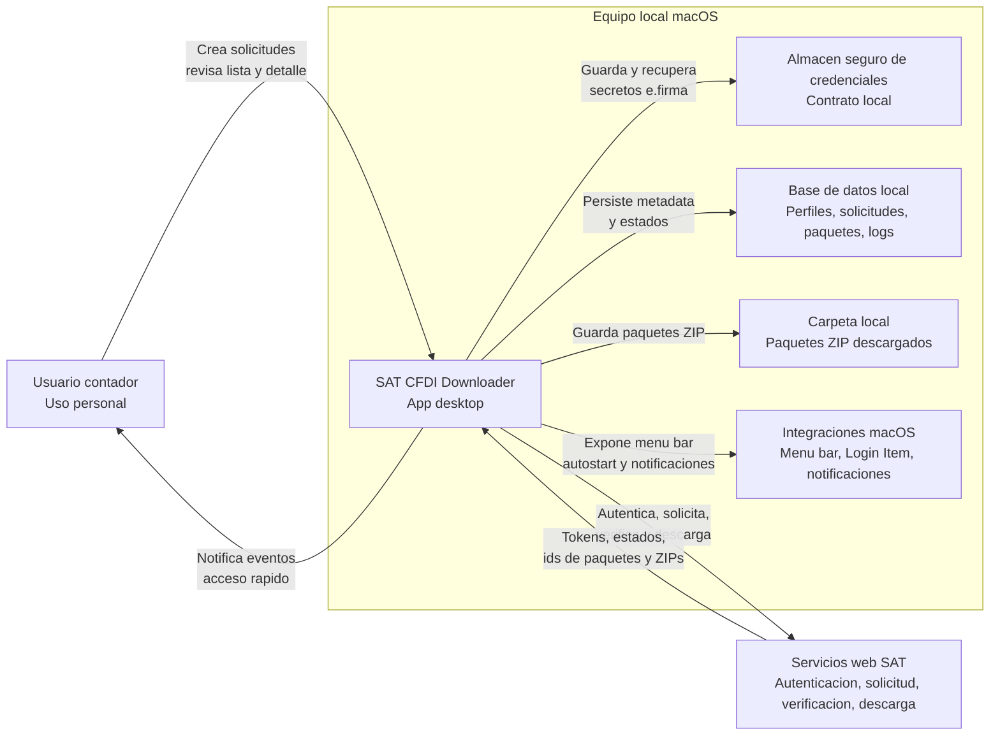
```mermaid
flowchart LR
    user["Usuario contador<br/>Uso personal"]

    subgraph macos["Equipo local macOS"]
        app["SAT CFDI Downloader<br/>App desktop"]
        secrets["Almacen seguro de credenciales<br/>Contrato local"]
        db["Base de datos local<br/>Perfiles, solicitudes, paquetes, logs"]
        files["Carpeta local<br/>Paquetes ZIP descargados"]
        os["Integraciones macOS<br/>Menu bar, Login Item, notificaciones"]
    end

    sat["Servicios web SAT<br/>Autenticacion, solicitud, verificacion, descarga"]

    user -->|"Crea solicitudes<br/>revisa lista y detalle"| app
    app -->|"Notifica eventos<br/>acceso rapido"| user

    app -->|"Guarda y recupera<br/>secretos e.firma"| secrets
    app -->|"Persiste metadata<br/>y estados"| db
    app -->|"Guarda paquetes ZIP"| files
    app -->|"Expone menu bar<br/>autostart y notificaciones"| os

    app -->|"Autentica, solicita,<br/>verifica y descarga"| sat
    sat -->|"Tokens, estados,<br/>ids de paquetes y ZIPs"| app
```

### Lectura del diagrama

- El sistema principal es `SAT CFDI Downloader`.
- Todo lo propio de la aplicacion vive en el equipo local macOS.
- No hay backend remoto propio.
- El unico sistema externo de negocio es el SAT.
- macOS participa como plataforma local para menu bar, inicio automatico y notificaciones.
- El almacen seguro de credenciales se modela como contrato local. `ADR 0010` define Keychain como adaptador inicial para macOS.
- La base de datos local guarda metadata operativa, no XML parseado.
- La carpeta local guarda paquetes ZIP descargados.

### Decisiones reflejadas

- Plataforma inicial: macOS.
- MVP: descargar y guardar paquetes ZIP.
- Fuera del MVP: extraer, parsear o indexar XML.
- Credenciales: protegidas localmente mediante un contrato de almacenamiento seguro.
- Worker: parte de la app local; no es backend remoto ni daemon multiusuario.

### Preguntas para revisar

- Validado: el SAT se muestra como unico sistema externo.
- Validado: base local y carpeta de paquetes ZIP se muestran separados porque tienen responsabilidades distintas.
- Validado por `ADR 0010`: el adaptador inicial de almacenamiento seguro en macOS usa Keychain.

## 2. Diagrama de casos de uso

Estado: validado.

Objetivo: describir las capacidades visibles del MVP separadas por actor para evitar un diagrama demasiado denso.

### 2.1 Actor: Usuario contador

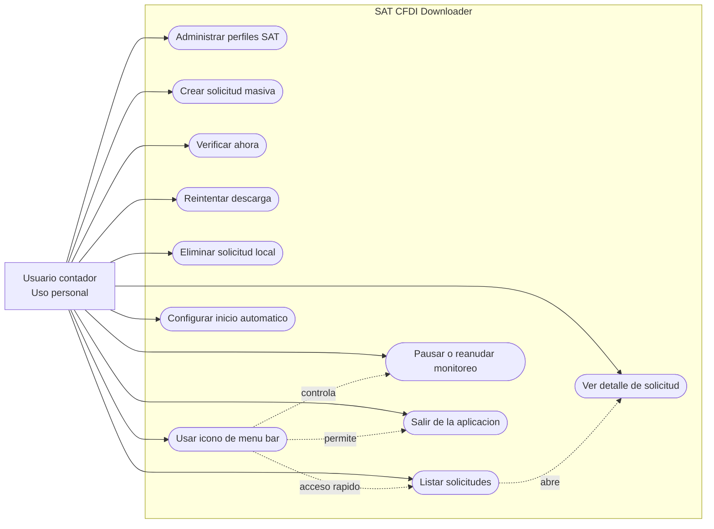
```mermaid
flowchart LR
    user["Usuario contador<br/>Uso personal"]

    subgraph app["SAT CFDI Downloader"]
        profiles(["Administrar perfiles SAT"])
        create(["Crear solicitud masiva"])
        list(["Listar solicitudes"])
        detail(["Ver detalle de solicitud"])
        verify_now(["Verificar ahora"])
        retry(["Reintentar descarga"])
        delete_local(["Eliminar solicitud local"])
        menu(["Usar icono de menu bar"])
        autostart(["Configurar inicio automatico"])
        pause(["Pausar o reanudar monitoreo"])
        exit(["Salir de la aplicacion"])
    end

    user --> profiles
    user --> create
    user --> list
    user --> detail
    user --> verify_now
    user --> retry
    user --> delete_local
    user --> menu
    user --> autostart
    user --> pause
    user --> exit

    list -. "abre" .-> detail
    menu -. "acceso rapido" .-> list
    menu -. "controla" .-> pause
    menu -. "permite" .-> exit
```

Lectura:

- Este diagrama muestra solo lo que el usuario ejecuta de forma directa.
- Las acciones manuales se muestran separadas porque tienen efectos distintos.
- `Eliminar solicitud local` no modifica nada en SAT.

### 2.2 Actor: Servicios web SAT

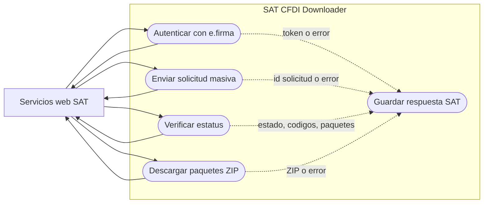
```mermaid
flowchart LR
    sat["Servicios web SAT"]

    subgraph app["SAT CFDI Downloader"]
        auth(["Autenticar con e.firma"])
        create(["Enviar solicitud masiva"])
        verify(["Verificar estatus"])
        download(["Descargar paquetes ZIP"])
        save_response(["Guardar respuesta SAT"])
    end

    auth --> sat
    create --> sat
    verify --> sat
    download --> sat

    sat --> auth
    sat --> create
    sat --> verify
    sat --> download

    auth -. "token o error" .-> save_response
    create -. "id solicitud o error" .-> save_response
    verify -. "estado, codigos, paquetes" .-> save_response
    download -. "ZIP o error" .-> save_response
```

Lectura:

- SAT sigue siendo un unico sistema externo.
- La separacion interna de autenticacion, solicitud, verificacion y descarga solo describe los casos de uso de la app contra SAT.
- Toda respuesta relevante del SAT se guarda localmente para trazabilidad.

### 2.3 Actor: macOS

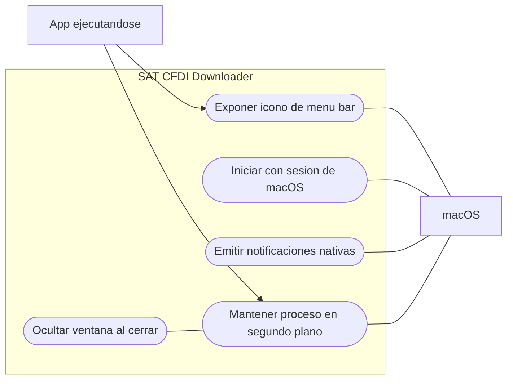
```mermaid
flowchart LR
    macos["macOS"]

    subgraph app["SAT CFDI Downloader"]
        menu(["Exponer icono de menu bar"])
        autostart(["Iniciar con sesion de macOS"])
        notify(["Emitir notificaciones nativas"])
        background(["Mantener proceso en segundo plano"])
        close_window(["Ocultar ventana al cerrar"])
    end

    app_boundary["App ejecutandose"] --> menu
    app_boundary --> background

    menu --- macos
    autostart --- macos
    notify --- macos
    background --- macos
    close_window --- background
```

Lectura:

- macOS es actor de soporte local, no sistema externo de negocio.
- El cierre de ventana no termina el proceso; lo deja accesible desde el menu bar.
- El inicio automatico depende de una preferencia habilitada por el usuario.

### Fuera de estos diagramas

- Extraer, parsear o indexar XML.
- Consultar CFDI por campos internos del XML.
- Validar vigencia o cancelacion.
- Exportar informacion contable.
- Administrar usuarios, roles o permisos.

### Preguntas para revisar

- Validado: las acciones manuales del usuario quedan separadas.
- Validado: `Autenticar con e.firma` se conserva como caso visible contra SAT.
- Validado: el diagrama de macOS aporta claridad y se conserva.

## 3. Diagramas de secuencia

Estado: validado.

Objetivo: describir las interacciones principales del MVP. Se agregara un flujo a la vez para mantener la revision simple.

### 3.1 Crear solicitud masiva

Estado: validado.

Este diagrama muestra el flujo desde que el usuario captura una solicitud hasta que la aplicacion guarda la metadata local y deja la solicitud lista para monitoreo.

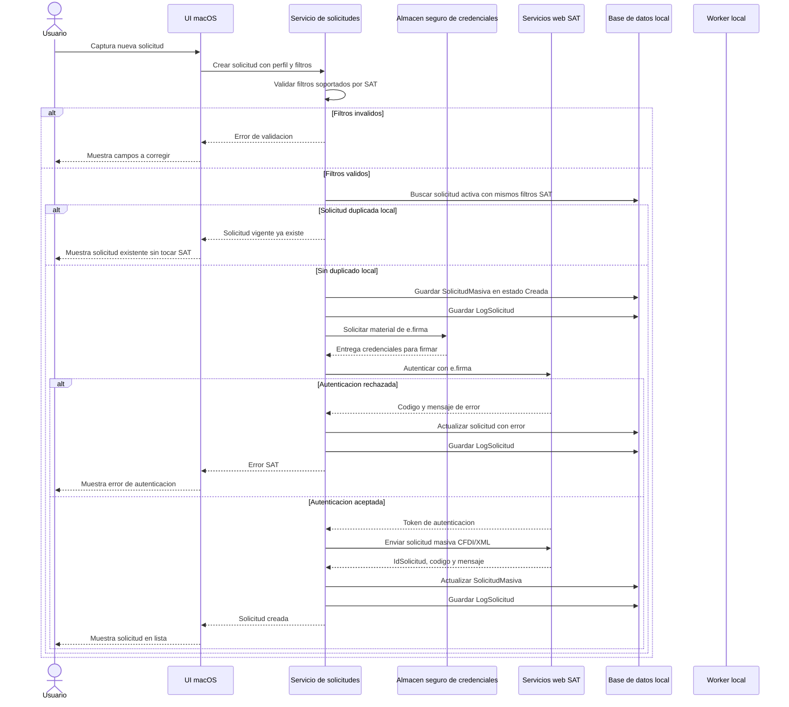
```mermaid
sequenceDiagram
    actor Usuario
    participant UI as UI macOS
    participant Solicitudes as Servicio de solicitudes
    participant Credenciales as Almacen seguro de credenciales
    participant SAT as Servicios web SAT
    participant DB as Base de datos local
    participant Worker as Worker local

    Usuario->>UI: Captura nueva solicitud
    UI->>Solicitudes: Crear solicitud con perfil y filtros
    Solicitudes->>Solicitudes: Validar filtros soportados por SAT

    alt Filtros invalidos
        Solicitudes-->>UI: Error de validacion
        UI-->>Usuario: Muestra campos a corregir
    else Filtros validos
        Solicitudes->>DB: Buscar solicitud activa con mismos filtros SAT

        alt Solicitud duplicada local
            Solicitudes-->>UI: Solicitud vigente ya existe
            UI-->>Usuario: Muestra solicitud existente sin tocar SAT
        else Sin duplicado local
            Solicitudes->>DB: Guardar SolicitudMasiva en estado Creada
            Solicitudes->>DB: Guardar LogSolicitud
            Solicitudes->>Credenciales: Solicitar material de e.firma
            Credenciales-->>Solicitudes: Entrega credenciales para firmar
            Solicitudes->>SAT: Autenticar con e.firma

            alt Autenticacion rechazada
                SAT-->>Solicitudes: Codigo y mensaje de error
                Solicitudes->>DB: Actualizar solicitud con error
                Solicitudes->>DB: Guardar LogSolicitud
                Solicitudes-->>UI: Error SAT
                UI-->>Usuario: Muestra error de autenticacion
            else Autenticacion aceptada
                SAT-->>Solicitudes: Token de autenticacion
                Solicitudes->>SAT: Enviar solicitud masiva CFDI/XML
                SAT-->>Solicitudes: IdSolicitud, codigo y mensaje
                Solicitudes->>DB: Actualizar SolicitudMasiva
                Solicitudes->>DB: Guardar LogSolicitud
                Solicitudes-->>UI: Solicitud creada
                UI-->>Usuario: Muestra solicitud en lista
            end
        end
    end
```

Lectura:

- La UI no habla directamente con SAT.
- El servicio de solicitudes valida filtros antes de autenticar o enviar.
- El servicio de solicitudes valida duplicados locales antes de tocar SAT para proteger al usuario de repetir accidentalmente una solicitud.
- Las credenciales se obtienen mediante el contrato de almacenamiento seguro.
- La respuesta SAT se guarda como metadata de la solicitud y log operativo.
- El worker no crea solicitudes ni necesita notificacion directa; detecta pendientes leyendo la base local.

Decisiones reflejadas:

- Tipo de solicitud MVP: CFDI/XML.
- Metadata local: se guarda a nivel solicitud, no a nivel XML.
- El flujo termina con una solicitud visible en la lista y lista para monitoreo.
- La solicitud se guarda localmente en estado `Creada` antes de llamar al SAT para conservar trazabilidad.
- La rama de filtros invalidos se mantiene porque representa validacion local antes de tocar SAT.
- La validacion anti-duplicados local evita llamadas que podrian topar codigos SAT como `5002` o `5005`.

Preguntas para revisar:

- Validado: el worker lee solicitudes pendientes desde la base local.
- Validado: se muestra el error de filtros para dejar claro que hay validacion local.
- Validado: la solicitud se guarda en estado `Creada` antes de llamar al SAT.

### 3.2 Worker verifica estatus

Estado: validado.

Este diagrama muestra como el worker local detecta solicitudes pendientes, consulta el estatus ante SAT y actualiza la base local.

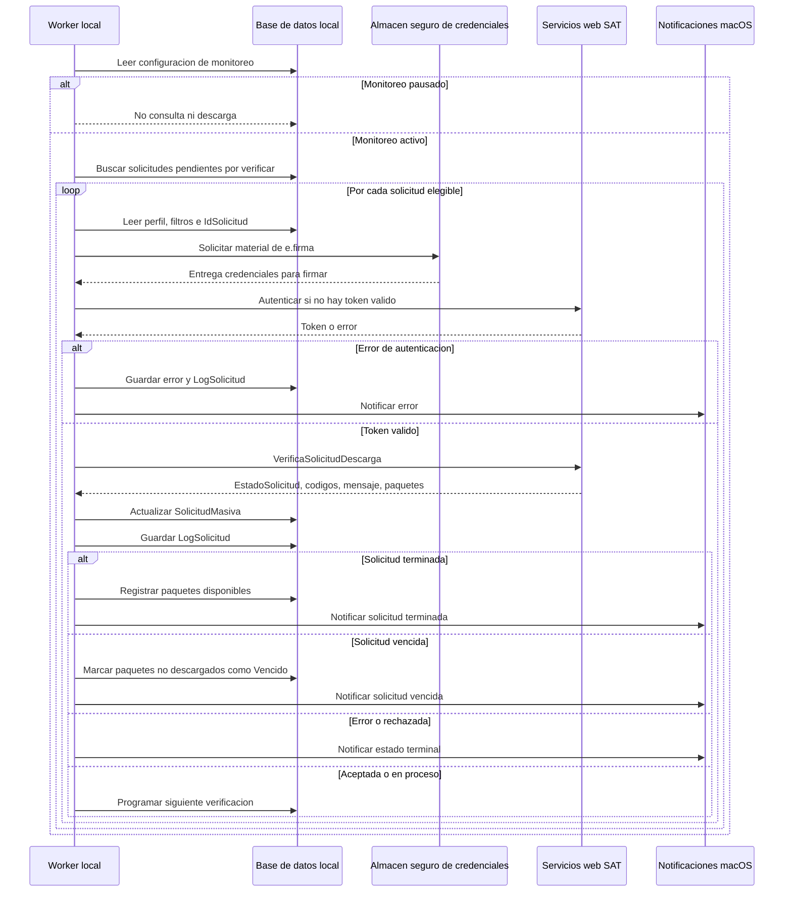
```mermaid
sequenceDiagram
    participant Worker as Worker local
    participant DB as Base de datos local
    participant Credenciales as Almacen seguro de credenciales
    participant SAT as Servicios web SAT
    participant Notificaciones as Notificaciones macOS

    Worker->>DB: Leer configuracion de monitoreo

    alt Monitoreo pausado
        Worker-->>DB: No consulta ni descarga
    else Monitoreo activo
        Worker->>DB: Buscar solicitudes pendientes por verificar

        loop Por cada solicitud elegible
            Worker->>DB: Leer perfil, filtros e IdSolicitud
            Worker->>Credenciales: Solicitar material de e.firma
            Credenciales-->>Worker: Entrega credenciales para firmar
            Worker->>SAT: Autenticar si no hay token valido
            SAT-->>Worker: Token o error

            alt Error de autenticacion
                Worker->>DB: Guardar error y LogSolicitud
                Worker->>Notificaciones: Notificar error
            else Token valido
                Worker->>SAT: VerificaSolicitudDescarga
                SAT-->>Worker: EstadoSolicitud, codigos, mensaje, paquetes
                Worker->>DB: Actualizar SolicitudMasiva
                Worker->>DB: Guardar LogSolicitud

                alt Solicitud terminada
                    Worker->>DB: Registrar paquetes disponibles
                    Worker->>Notificaciones: Notificar solicitud terminada
                else Solicitud vencida
                    Worker->>DB: Marcar paquetes no descargados como Vencido
                    Worker->>Notificaciones: Notificar solicitud vencida
                else Error o rechazada
                    Worker->>Notificaciones: Notificar estado terminal
                else Aceptada o en proceso
                    Worker->>DB: Programar siguiente verificacion
                end
            end
        end
    end
```

Lectura:

- El worker parte de la base local; no depende de una notificacion directa de la UI.
- Si el monitoreo esta pausado, el worker no consulta SAT.
- La autenticacion puede reutilizar token valido o solicitar uno nuevo, segun lo permita la implementacion.
- La respuesta de `VerificaSolicitudDescarga` actualiza la solicitud y queda registrada en logs.
- Si SAT devuelve paquetes, solo se registran como disponibles; la descarga se modelara en el siguiente diagrama.
- `Actualizar SolicitudMasiva` guarda que la solicitud cambio a terminada, con codigo y mensaje SAT.
- `Registrar paquetes disponibles` crea o actualiza registros `PaqueteSolicitud` con los IDs que devolvio SAT.
- `Descargar paquetes ZIP` queda para otro flujo.
- Si SAT marca la solicitud como vencida, el worker marca los paquetes no descargados como `Vencido` en la misma actualizacion local.

Decisiones reflejadas:

- El worker consulta cada 10 minutos solicitudes pendientes y aplica backoff a 30 minutos tras tres verificaciones sin cambio.
- Error, rechazada y vencida generan notificacion.
- Terminada genera notificacion y deja paquetes listos para descarga.
- La propagacion de vencimiento de solicitud a paquetes hijos es responsabilidad del worker.

Preguntas para revisar:

- Validado: la regla 10 minutos / 30 minutos basta mencionarla en texto.
- Validado: la autenticacion puede aparecer dentro del flujo del worker.
- Validado: `Actualizar SolicitudMasiva` y `Registrar paquetes disponibles` quedan como pasos separados.

### 3.3 Worker descarga paquetes ZIP

Estado: validado.

Este diagrama muestra como el worker local descarga paquetes ZIP previamente registrados como disponibles. El flujo parte de `PaqueteSolicitud`, no de XML individuales.

Base documental:

- `docs/web-service.md` documenta que una solicitud terminada puede devolver `IdsPaquetes`.
- `docs/web-service.md` documenta que el SAT permite descargar archivos XML o metadata en archivos compactados cuando la solicitud fue procesada exitosamente.
- El contrato exacto del servicio de descarga de paquete queda pendiente de confirmar antes de implementar.

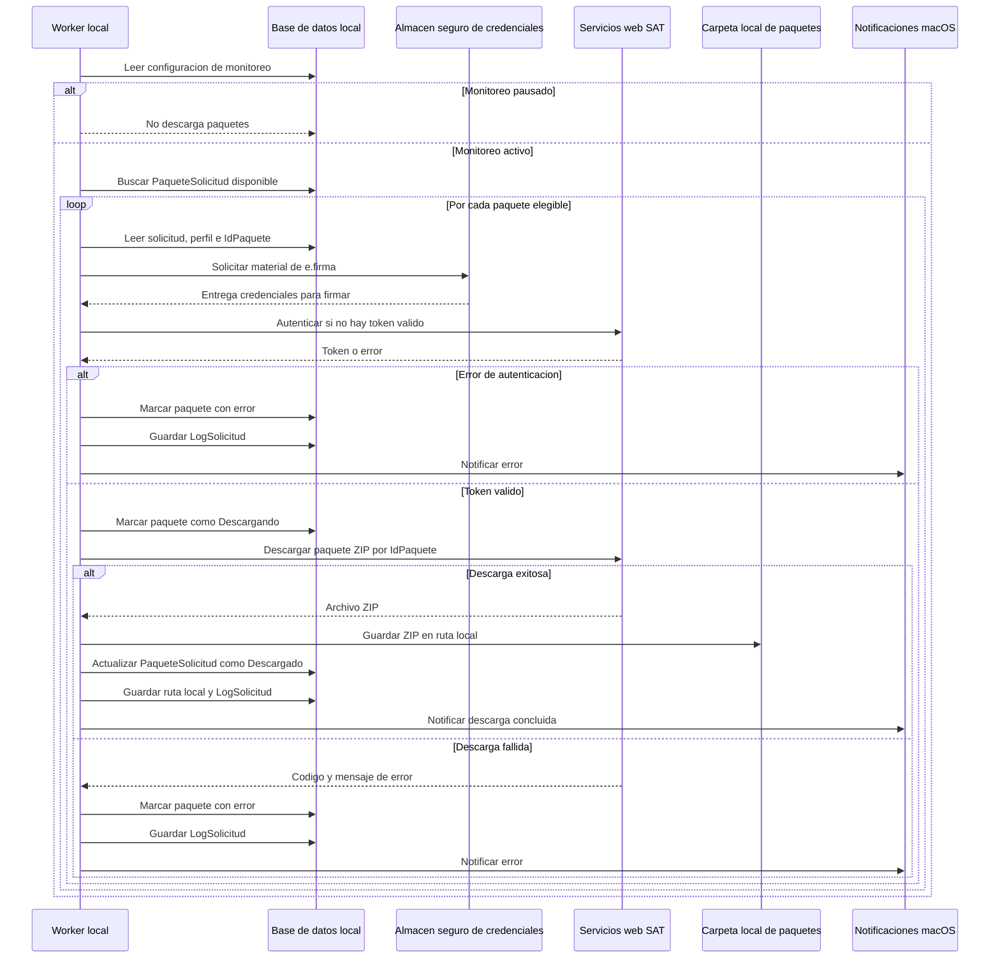
```mermaid
sequenceDiagram
    participant Worker as Worker local
    participant DB as Base de datos local
    participant Credenciales as Almacen seguro de credenciales
    participant SAT as Servicios web SAT
    participant Archivos as Carpeta local de paquetes
    participant Notificaciones as Notificaciones macOS

    Worker->>DB: Leer configuracion de monitoreo

    alt Monitoreo pausado
        Worker-->>DB: No descarga paquetes
    else Monitoreo activo
        Worker->>DB: Buscar PaqueteSolicitud disponible

        loop Por cada paquete elegible
            Worker->>DB: Leer solicitud, perfil e IdPaquete
            Worker->>Credenciales: Solicitar material de e.firma
            Credenciales-->>Worker: Entrega credenciales para firmar
            Worker->>SAT: Autenticar si no hay token valido
            SAT-->>Worker: Token o error

            alt Error de autenticacion
                Worker->>DB: Marcar paquete con error
                Worker->>DB: Guardar LogSolicitud
                Worker->>Notificaciones: Notificar error
            else Token valido
                Worker->>DB: Marcar paquete como Descargando
                Worker->>SAT: Descargar paquete ZIP por IdPaquete

                alt Descarga exitosa
                    SAT-->>Worker: Archivo ZIP
                    Worker->>Archivos: Guardar ZIP en ruta local
                    Worker->>DB: Actualizar PaqueteSolicitud como Descargado
                    Worker->>DB: Guardar ruta local y LogSolicitud
                    Worker->>Notificaciones: Notificar descarga concluida
                else Descarga fallida
                    SAT-->>Worker: Codigo y mensaje de error
                    Worker->>DB: Marcar paquete con error
                    Worker->>DB: Guardar LogSolicitud
                    Worker->>Notificaciones: Notificar error
                end
            end
        end
    end
```

Lectura:

- El worker solo descarga paquetes que ya existen como `PaqueteSolicitud`.
- La descarga usa `IdPaquete`, asociado previamente a una `SolicitudMasiva`.
- El ZIP se guarda en la carpeta local definida para la solicitud.
- El MVP no valida que el ZIP pueda abrirse antes de marcarlo como descargado.
- El MVP no extrae, parsea ni indexa XML despues de guardar el ZIP.
- Si la descarga falla, queda registrado el error y el usuario puede reintentar manualmente.
- Si el monitoreo esta pausado, el worker no descarga paquetes.
- El worker no reintenta automaticamente paquetes en `Error`; esos paquetes requieren accion manual.

Decisiones reflejadas:

- La descarga automatica ocurre cuando SAT reporto paquetes disponibles y el monitoreo esta activo.
- Los paquetes ZIP no se borran automaticamente.
- `Eliminar solicitud local` no borra ZIPs ya descargados.
- Una descarga manual solo aplica a paquetes pendientes, fallidos o no descargados por pausa del worker.
- Los paquetes en `Error` se reintentan solo por accion manual.

Preguntas para revisar:

- Validado: no se valida que el ZIP pueda abrirse antes de marcarlo descargado.
- Validado: el paquete se marca como `Descargando` despues de obtener token valido.
- Validado: los paquetes ya descargados se ignoran; no se usa estado `Sin accion requerida`.
- Validado: el worker automatico no procesa paquetes en `Error`; el reintento es manual.

### 3.4 Usuario consulta lista y detalle

Estado: validado.

Este diagrama muestra como el usuario consulta solicitudes guardadas localmente y navega al detalle de una solicitud. No hay comunicacion con SAT en este flujo.

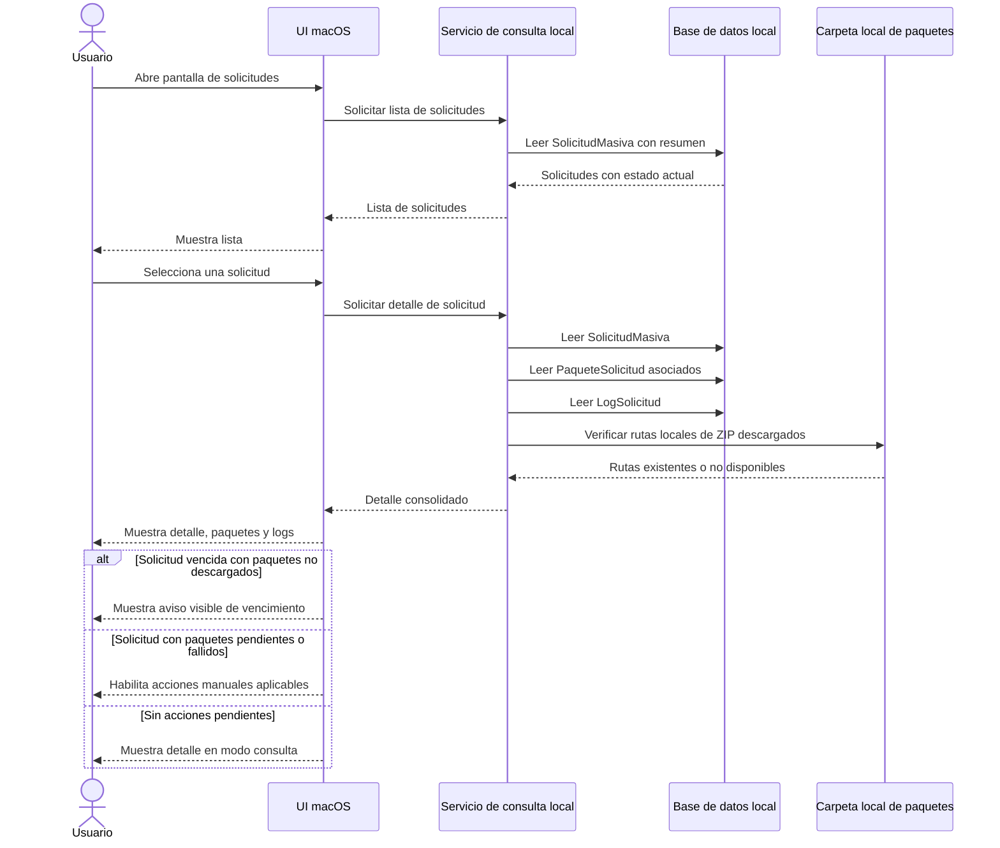
```mermaid
sequenceDiagram
    actor Usuario
    participant UI as UI macOS
    participant Consultas as Servicio de consulta local
    participant DB as Base de datos local
    participant Archivos as Carpeta local de paquetes

    Usuario->>UI: Abre pantalla de solicitudes
    UI->>Consultas: Solicitar lista de solicitudes
    Consultas->>DB: Leer SolicitudMasiva con resumen
    DB-->>Consultas: Solicitudes con estado actual
    Consultas-->>UI: Lista de solicitudes
    UI-->>Usuario: Muestra lista

    Usuario->>UI: Selecciona una solicitud
    UI->>Consultas: Solicitar detalle de solicitud
    Consultas->>DB: Leer SolicitudMasiva
    Consultas->>DB: Leer PaqueteSolicitud asociados
    Consultas->>DB: Leer LogSolicitud
    Consultas->>Archivos: Verificar rutas locales de ZIP descargados
    Archivos-->>Consultas: Rutas existentes o no disponibles
    Consultas-->>UI: Detalle consolidado
    UI-->>Usuario: Muestra detalle, paquetes y logs

    alt Solicitud vencida con paquetes no descargados
        UI-->>Usuario: Muestra aviso visible de vencimiento
    else Solicitud con paquetes pendientes o fallidos
        UI-->>Usuario: Habilita acciones manuales aplicables
    else Sin acciones pendientes
        UI-->>Usuario: Muestra detalle en modo consulta
    end
```

Lectura:

- Este flujo es local y no toca SAT.
- La lista y el detalle se leen desde la base de datos local.
- La carpeta local solo se consulta para saber si existen rutas de ZIP ya descargados.
- La lista no consulta `LogSolicitud`; los logs se leen solo al abrir el detalle.
- Las acciones manuales pueden habilitarse desde la UI, pero su ejecucion se modelara en otro diagrama.
- Si una solicitud esta vencida y hay paquetes no descargados, la UI debe mostrarlo de forma visible.

Decisiones reflejadas:

- La pantalla principal se alimenta de `SolicitudMasiva`.
- El detalle consolida solicitud, paquetes y logs.
- El MVP no muestra contenido interno de XML.
- Eliminar una solicitud local no toca SAT y no borra ZIPs automaticamente.

Preguntas para revisar:

- Validado: la UI verifica existencia de ZIPs en carpeta local al abrir detalle.
- Validado: el aviso de vencimiento tambien debe mostrarse en el detalle.
- Validado: solo el detalle consulta `LogSolicitud`; la lista no lee logs resumidos.

### 3.5 Acciones manuales sobre solicitud

Estado: validado.

Este diagrama muestra las acciones que el usuario puede ejecutar desde la lista o el detalle: verificar ahora, reintentar descarga y eliminar solicitud local.

#### 3.5.1 Verificar ahora

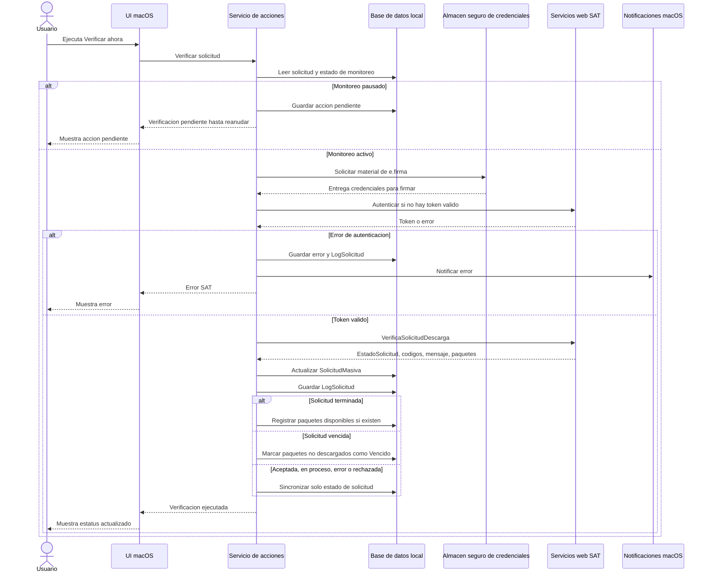
```mermaid
sequenceDiagram
    actor Usuario
    participant UI as UI macOS
    participant Acciones as Servicio de acciones
    participant DB as Base de datos local
    participant Credenciales as Almacen seguro de credenciales
    participant SAT as Servicios web SAT
    participant Notificaciones as Notificaciones macOS

    Usuario->>UI: Ejecuta Verificar ahora
    UI->>Acciones: Verificar solicitud
    Acciones->>DB: Leer solicitud y estado de monitoreo

    alt Monitoreo pausado
        Acciones->>DB: Guardar accion pendiente
        Acciones-->>UI: Verificacion pendiente hasta reanudar
        UI-->>Usuario: Muestra accion pendiente
    else Monitoreo activo
        Acciones->>Credenciales: Solicitar material de e.firma
        Credenciales-->>Acciones: Entrega credenciales para firmar
        Acciones->>SAT: Autenticar si no hay token valido
        SAT-->>Acciones: Token o error

        alt Error de autenticacion
            Acciones->>DB: Guardar error y LogSolicitud
            Acciones->>Notificaciones: Notificar error
            Acciones-->>UI: Error SAT
            UI-->>Usuario: Muestra error
        else Token valido
            Acciones->>SAT: VerificaSolicitudDescarga
            SAT-->>Acciones: EstadoSolicitud, codigos, mensaje, paquetes
            Acciones->>DB: Actualizar SolicitudMasiva
            Acciones->>DB: Guardar LogSolicitud

            alt Solicitud terminada
                Acciones->>DB: Registrar paquetes disponibles si existen
            else Solicitud vencida
                Acciones->>DB: Marcar paquetes no descargados como Vencido
            else Aceptada, en proceso, error o rechazada
                Acciones->>DB: Sincronizar solo estado de solicitud
            end

            Acciones-->>UI: Verificacion ejecutada
            UI-->>Usuario: Muestra estatus actualizado
        end
    end
```

#### 3.5.2 Reintentar descarga

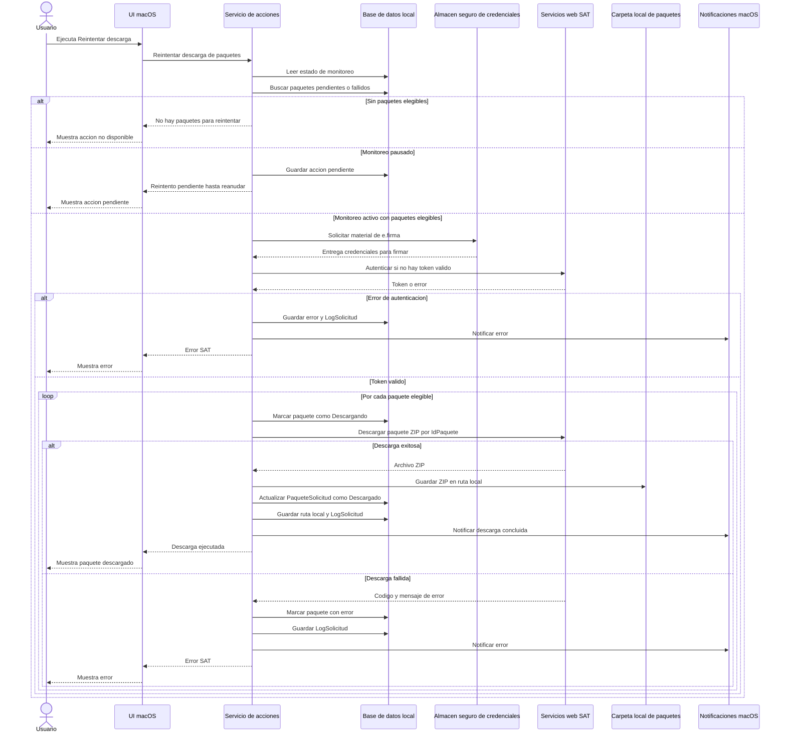
```mermaid
sequenceDiagram
    actor Usuario
    participant UI as UI macOS
    participant Acciones as Servicio de acciones
    participant DB as Base de datos local
    participant Credenciales as Almacen seguro de credenciales
    participant SAT as Servicios web SAT
    participant Archivos as Carpeta local de paquetes
    participant Notificaciones as Notificaciones macOS

    Usuario->>UI: Ejecuta Reintentar descarga
    UI->>Acciones: Reintentar descarga de paquetes
    Acciones->>DB: Leer estado de monitoreo
    Acciones->>DB: Buscar paquetes pendientes o fallidos

    alt Sin paquetes elegibles
        Acciones-->>UI: No hay paquetes para reintentar
        UI-->>Usuario: Muestra accion no disponible
    else Monitoreo pausado
        Acciones->>DB: Guardar accion pendiente
        Acciones-->>UI: Reintento pendiente hasta reanudar
        UI-->>Usuario: Muestra accion pendiente
    else Monitoreo activo con paquetes elegibles
        Acciones->>Credenciales: Solicitar material de e.firma
        Credenciales-->>Acciones: Entrega credenciales para firmar
        Acciones->>SAT: Autenticar si no hay token valido
        SAT-->>Acciones: Token o error

        alt Error de autenticacion
            Acciones->>DB: Guardar error y LogSolicitud
            Acciones->>Notificaciones: Notificar error
            Acciones-->>UI: Error SAT
            UI-->>Usuario: Muestra error
        else Token valido
            loop Por cada paquete elegible
                Acciones->>DB: Marcar paquete como Descargando
                Acciones->>SAT: Descargar paquete ZIP por IdPaquete

                alt Descarga exitosa
                    SAT-->>Acciones: Archivo ZIP
                    Acciones->>Archivos: Guardar ZIP en ruta local
                    Acciones->>DB: Actualizar PaqueteSolicitud como Descargado
                    Acciones->>DB: Guardar ruta local y LogSolicitud
                    Acciones->>Notificaciones: Notificar descarga concluida
                    Acciones-->>UI: Descarga ejecutada
                    UI-->>Usuario: Muestra paquete descargado
                else Descarga fallida
                    SAT-->>Acciones: Codigo y mensaje de error
                    Acciones->>DB: Marcar paquete con error
                    Acciones->>DB: Guardar LogSolicitud
                    Acciones->>Notificaciones: Notificar error
                    Acciones-->>UI: Error SAT
                    UI-->>Usuario: Muestra error
                end
            end
        end
    end
```

#### 3.5.3 Eliminar solicitud local

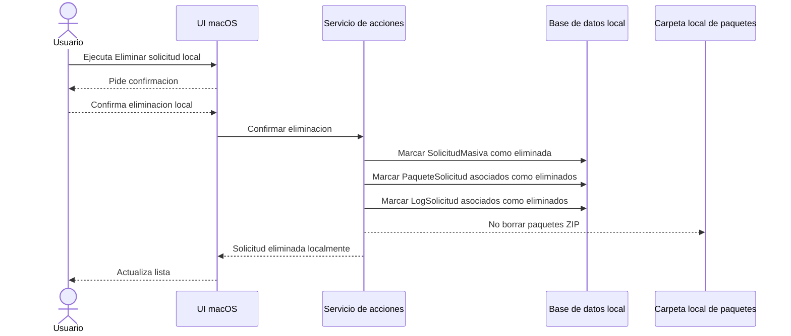
```mermaid
sequenceDiagram
    actor Usuario
    participant UI as UI macOS
    participant Acciones as Servicio de acciones
    participant DB as Base de datos local
    participant Archivos as Carpeta local de paquetes

    Usuario->>UI: Ejecuta Eliminar solicitud local
    UI-->>Usuario: Pide confirmacion
    Usuario-->>UI: Confirma eliminacion local
    UI->>Acciones: Confirmar eliminacion
    Acciones->>DB: Marcar SolicitudMasiva como eliminada
    Acciones->>DB: Marcar PaqueteSolicitud asociados como eliminados
    Acciones->>DB: Marcar LogSolicitud asociados como eliminados
    Acciones-->>Archivos: No borrar paquetes ZIP
    Acciones-->>UI: Solicitud eliminada localmente
    UI-->>Usuario: Actualiza lista
```

Lectura:

- La UI no ejecuta directamente verificaciones ni descargas contra SAT.
- Verificar ahora y reintentar descarga son ejecutadas por el `Servicio de acciones`.
- Si el monitoreo esta pausado, las acciones de verificacion y descarga quedan pendientes hasta reanudar.
- Reintentar descarga solo aplica a paquetes pendientes o fallidos.
- Eliminar solicitud local requiere confirmacion del usuario.
- Eliminar solicitud local es una eliminacion virtual: marca `SolicitudMasiva`, `PaqueteSolicitud` y `LogSolicitud` como eliminados, pero no borra paquetes ZIP ya descargados.

Decisiones reflejadas:

- El `Servicio de acciones` es responsable de ejecutar acciones manuales.
- El worker sigue siendo responsable del monitoreo automatico.
- Las acciones manuales pendientes quedan persistidas en la base local.
- No hay cambios remotos en SAT al eliminar una solicitud local.
- El MVP no borra archivos ZIP automaticamente.

Preguntas para revisar:

- Validado: verificar ahora y reintentar descarga se ejecutan desde el `Servicio de acciones`, no desde el worker.
- Validado: si el monitoreo esta pausado, la accion queda pendiente hasta reanudar.
- Validado: eliminar solicitud local marca virtualmente como eliminados `SolicitudMasiva`, `PaqueteSolicitud` y `LogSolicitud`.

### 3.6 Ciclo macOS: inicio, menu bar y cierre

Estado: validado.

Este diagrama muestra como la aplicacion se integra con macOS para iniciar con la sesion, mantenerse en segundo plano, ocultar la ventana principal y salir solo por accion explicita.

La decision de activacion macOS queda fijada en `ADR 0009`: foreground al abrir manualmente, background/menu bar al iniciar por Login Item.

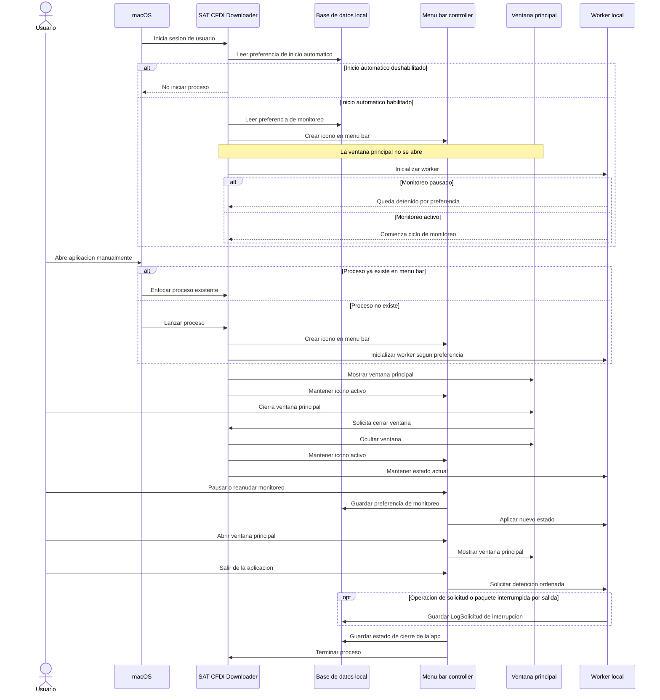
```mermaid
sequenceDiagram
    actor Usuario
    participant macOS as macOS
    participant App as SAT CFDI Downloader
    participant DB as Base de datos local
    participant MenuBar as Menu bar controller
    participant UI as Ventana principal
    participant Worker as Worker local

    macOS->>App: Inicia sesion de usuario
    App->>DB: Leer preferencia de inicio automatico

    alt Inicio automatico deshabilitado
        App-->>macOS: No iniciar proceso
    else Inicio automatico habilitado
        App->>DB: Leer preferencia de monitoreo
        App->>MenuBar: Crear icono en menu bar
        Note over App,UI: La ventana principal no se abre
        App->>Worker: Inicializar worker

        alt Monitoreo pausado
            Worker-->>App: Queda detenido por preferencia
        else Monitoreo activo
            Worker-->>App: Comienza ciclo de monitoreo
        end
    end

    Usuario->>macOS: Abre aplicacion manualmente
    alt Proceso ya existe en menu bar
        macOS->>App: Enfocar proceso existente
    else Proceso no existe
        macOS->>App: Lanzar proceso
        App->>MenuBar: Crear icono en menu bar
        App->>Worker: Inicializar worker segun preferencia
    end
    App->>UI: Mostrar ventana principal
    App->>MenuBar: Mantener icono activo

    Usuario->>UI: Cierra ventana principal
    UI->>App: Solicita cerrar ventana
    App->>UI: Ocultar ventana
    App->>MenuBar: Mantener icono activo
    App->>Worker: Mantener estado actual

    Usuario->>MenuBar: Pausar o reanudar monitoreo
    MenuBar->>DB: Guardar preferencia de monitoreo
    MenuBar->>Worker: Aplicar nuevo estado

    Usuario->>MenuBar: Abrir ventana principal
    MenuBar->>UI: Mostrar ventana principal

    Usuario->>MenuBar: Salir de la aplicacion
    MenuBar->>Worker: Solicitar detencion ordenada
    opt Operacion de solicitud o paquete interrumpida por salida
        Worker->>DB: Guardar LogSolicitud de interrupcion
    end
    MenuBar->>DB: Guardar estado de cierre de la app
    MenuBar->>App: Terminar proceso
```

Lectura:

- El inicio automatico depende de una preferencia local deshabilitada por defecto.
- Cuando el inicio automatico esta habilitado, la app inicia solo con icono de menu bar y worker; no muestra la ventana principal.
- Cuando el usuario abre manualmente la app, la ventana principal se muestra aunque el proceso ya estuviera vivo en el menu bar.
- La politica de activacion macOS se resuelve dentro de `OSIntegration`; el dominio solo depende de las intenciones "foreground" y "background".
- El menu bar es el punto de acceso cuando la ventana principal esta oculta.
- Cerrar la ventana no termina el proceso ni detiene el worker.
- Pausar o reanudar monitoreo se guarda como preferencia persistente.
- Salir de la aplicacion detiene el worker, guarda estado de cierre a nivel app y termina el proceso local.
- El cierre normal no crea `LogSolicitud` para cada solicitud activa. Solo se registra `LogSolicitud` si una operacion concreta de solicitud o paquete fue interrumpida por la salida.

Decisiones reflejadas:

- Plataforma del MVP: macOS.
- La app puede vivir en segundo plano desde el menu bar.
- El inicio automatico no abre la ventana principal.
- La apertura manual siempre muestra la ventana principal.
- No hay daemon multiusuario ni backend remoto.
- El worker respeta la preferencia persistente de monitoreo.
- La salida real requiere accion explicita.
- Los logs de solicitud se reservan para eventos de solicitud, no para cierres normales de app.

Preguntas para revisar:

- Validado: en inicio automatico se abre solo el icono de menu bar, no la ventana principal.
- Validado: al abrir manualmente la app, siempre se muestra la ventana principal aunque el proceso ya exista en menu bar.
- Validado: al salir se guarda estado de cierre de app y solo se registra `LogSolicitud` si una operacion concreta fue interrumpida.

## 4. Diagrama de componentes

Estado: validado.

Objetivo: mostrar los modulos principales dentro de la aplicacion macOS y los contratos que separan UI, casos de uso, persistencia, archivos, credenciales y comunicacion con SAT.

El stack inicial queda definido en `ADR 0011`: Qt 6, QML / Qt Quick Controls para UI y C++/Qt para servicios, dominio y adaptadores.
La estructura fisica de carpetas y targets CMake queda definida en `ADR 0012` y `docs/design/qt-project-structure.md`.

```mermaid
flowchart TB
    subgraph app["SAT CFDI Downloader - proceso local macOS - Qt 6"]
        subgraph presentation["Presentacion QML / Qt Quick Controls"]
            main_ui["Ventana principal QML"]
            menu_bar["Menu bar controller"]
            notifications_ui["Notificaciones de UI"]
        end

        subgraph application["Aplicacion / Casos de uso C++"]
            profiles_service["Servicio de perfiles SAT"]
            request_service["Servicio de solicitudes"]
            query_service["Servicio de consulta local"]
            actions_service["Servicio de acciones manuales"]
            worker["Worker local<br/>monitoreo y backoff"]
        end

        subgraph domain["Dominio C++"]
            request_state["Reglas de estado<br/>SolicitudMasiva / PaqueteSolicitud"]
            sat_filters["Reglas de filtros SAT"]
            local_retention["Reglas de retencion local"]
        end

        subgraph ports["Contratos internos"]
            sat_gateway["Contrato SAT"]
            credentials_store["Contrato de credenciales seguras"]
            repositories["Contrato de persistencia local"]
            package_storage["Contrato de almacenamiento de paquetes"]
            os_integration["Contrato de integracion SO"]
        end

        subgraph infrastructure["Adaptadores locales"]
            sat_adapter["Adaptador servicios web SAT"]
            secure_credentials_adapter["Adaptador almacenamiento seguro"]
            db_adapter["Adaptador base de datos local<br/>SQLite"]
            file_adapter["Adaptador carpeta de paquetes ZIP"]
            macos_adapter["Adaptador macOS<br/>Login Item, menu bar, notificaciones"]
        end
    end

    sat["Servicios web SAT"]
    local_db["Base de datos local"]
    local_files["Carpeta local de paquetes ZIP"]
    secure_store["Almacen seguro local"]
    macos["macOS"]

    main_ui --> request_service
    main_ui --> query_service
    main_ui --> profiles_service
    main_ui --> actions_service
    menu_bar --> actions_service
    menu_bar --> worker
    notifications_ui --> os_integration

    request_service --> sat_filters
    request_service --> request_state
    request_service --> sat_gateway
    request_service --> credentials_store
    request_service --> repositories

    query_service --> repositories
    query_service --> package_storage

    actions_service --> request_state
    actions_service --> sat_gateway
    actions_service --> credentials_store
    actions_service --> repositories
    actions_service --> package_storage
    actions_service --> os_integration

    worker --> request_state
    worker --> sat_gateway
    worker --> credentials_store
    worker --> repositories
    worker --> package_storage
    worker --> os_integration

    profiles_service --> credentials_store
    profiles_service --> repositories

    sat_gateway --> sat_adapter
    credentials_store --> secure_credentials_adapter
    repositories --> db_adapter
    package_storage --> file_adapter
    os_integration --> macos_adapter

    sat_adapter --> sat
    db_adapter --> local_db
    file_adapter --> local_files
    secure_credentials_adapter --> secure_store
    macos_adapter --> macos
```

### Lectura del diagrama

- La aplicacion es un solo proceso local de macOS. El worker vive dentro de la app; no es backend remoto ni daemon multiusuario.
- La UI no accede directamente a SAT, base de datos, archivos ni credenciales. Siempre pasa por servicios de aplicacion.
- Los servicios de aplicacion representan los casos de uso ya validados: perfiles, crear solicitud, consultar lista/detalle, acciones manuales y monitoreo automatico.
- El dominio concentra reglas que no deben quedar escondidas en la UI: estados de solicitud/paquete, filtros SAT y retencion local.
- Los contratos internos permiten cambiar detalles de implementacion sin cambiar los casos de uso. Por ejemplo, el almacenamiento seguro se mantiene como contrato, no como dependencia concreta.
- Los adaptadores son la parte que habla con SAT, macOS, base local, carpeta de ZIPs y almacenamiento seguro local.
- El contrato de integracion con sistema operativo es generico; macOS es el adaptador inicial del MVP.
- La politica de monitoreo y backoff vive dentro del worker; no se modela como componente separado.
- QML no contiene reglas SAT, reglas de estado ni acceso directo a base de datos; consume servicios expuestos desde C++.
- La composition root vive en el target ejecutable y conecta servicios con adaptadores concretos.

### Decisiones reflejadas

- Arquitectura local-first, orientada a uso personal.
- Un solo proceso macOS con UI, menu bar y worker local.
- Separacion entre acciones manuales y worker automatico.
- `Servicio de acciones manuales` se conserva separado de `Servicio de solicitudes`.
- Separacion entre metadata persistida en base local y paquetes ZIP guardados en carpeta local.
- Dependencias externas/locales encapsuladas detras de contratos.
- El contrato de integracion SO cubre menu bar, Login Item y notificaciones; macOS es la implementacion inicial.
- Sin extraccion, parseo ni indexacion de XML en el MVP.
- Stack de aplicacion: Qt 6, QML / Qt Quick Controls, C++ y CMake.
- Estructura de implementacion: capas y targets CMake por `presentation`, `application`, `domain`, `ports`, `infrastructure` y `app`.

### Preguntas para revisar

- Validado: `Servicio de acciones manuales` queda separado de `Servicio de solicitudes`.
- Validado: la politica de monitoreo y backoff queda dentro del worker.
- Validado: `Contrato de integracion SO` cubre menu bar, Login Item y notificaciones; el adaptador inicial es macOS.

## 5. Diagrama de dominio y datos locales

Estado: validado.

Objetivo: modelar las entidades persistidas por la aplicacion sin introducir usuarios, clientes, organizaciones ni estructuras comerciales. El modelo se mantiene acotado al uso personal y al MVP de solicitudes masivas y paquetes ZIP.

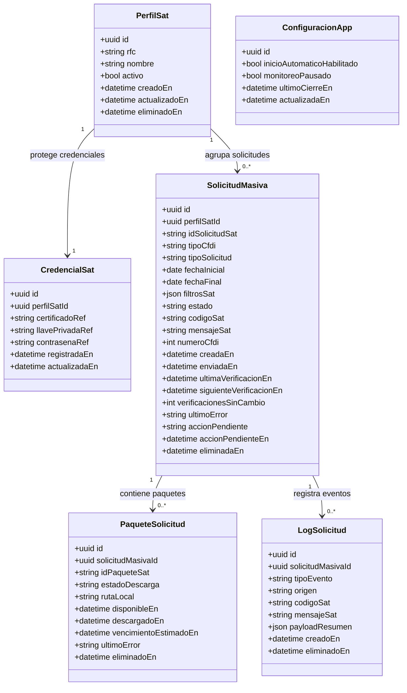
```mermaid
classDiagram
    class PerfilSat {
        +uuid id
        +string rfc
        +string nombre
        +bool activo
        +datetime creadoEn
        +datetime actualizadoEn
        +datetime eliminadoEn
    }

    class CredencialSat {
        +uuid id
        +uuid perfilSatId
        +string certificadoRef
        +string llavePrivadaRef
        +string contrasenaRef
        +datetime registradaEn
        +datetime actualizadaEn
    }

    class SolicitudMasiva {
        +uuid id
        +uuid perfilSatId
        +string idSolicitudSat
        +string tipoCfdi
        +string tipoSolicitud
        +date fechaInicial
        +date fechaFinal
        +json filtrosSat
        +string estado
        +string codigoSat
        +string mensajeSat
        +int numeroCfdi
        +datetime creadaEn
        +datetime enviadaEn
        +datetime ultimaVerificacionEn
        +datetime siguienteVerificacionEn
        +int verificacionesSinCambio
        +string ultimoError
        +string accionPendiente
        +datetime accionPendienteEn
        +datetime eliminadaEn
    }

    class PaqueteSolicitud {
        +uuid id
        +uuid solicitudMasivaId
        +string idPaqueteSat
        +string estadoDescarga
        +string rutaLocal
        +datetime disponibleEn
        +datetime descargadoEn
        +datetime vencimientoEstimadoEn
        +string ultimoError
        +datetime eliminadoEn
    }

    class LogSolicitud {
        +uuid id
        +uuid solicitudMasivaId
        +string tipoEvento
        +string origen
        +string codigoSat
        +string mensajeSat
        +json payloadResumen
        +datetime creadoEn
        +datetime eliminadoEn
    }

    class ConfiguracionApp {
        +uuid id
        +bool inicioAutomaticoHabilitado
        +bool monitoreoPausado
        +datetime ultimoCierreEn
        +datetime actualizadaEn
    }

    PerfilSat "1" --> "1" CredencialSat : protege credenciales
    PerfilSat "1" --> "0..*" SolicitudMasiva : agrupa solicitudes
    SolicitudMasiva "1" --> "0..*" PaqueteSolicitud : contiene paquetes
    SolicitudMasiva "1" --> "0..*" LogSolicitud : registra eventos
```

### Lectura del diagrama

- No existe entidad `Usuario`: el producto es personal y corre en la sesion local de macOS.
- No existe entidad `Cliente`: los contribuyentes/RFC se modelan como `PerfilSat`.
- `CredencialSat` no contiene secretos en claro. Solo guarda referencias al contrato de almacenamiento seguro.
- `SolicitudMasiva` conserva filtros, estado, codigo/mensaje SAT y datos necesarios para el monitoreo.
- `PaqueteSolicitud` representa paquetes ZIP, no XML individuales.
- `LogSolicitud` pertenece al historial operativo de una solicitud. No se usa para registrar cierres normales de la aplicacion.
- `ConfiguracionApp` centraliza preferencias locales: inicio automatico, pausa de monitoreo y ultimo cierre.
- Las acciones manuales pendientes se guardan dentro de `SolicitudMasiva` para evitar una cola separada en el MVP.
- La eliminacion local es virtual mediante campos `eliminadoEn`; no borra ZIPs automaticamente.

### Decisiones reflejadas

- Modelo local-first para una sola persona.
- Sin multiusuario, permisos, clientes comerciales ni organizaciones.
- Persistencia separada entre metadata de solicitudes y archivos ZIP.
- Las credenciales se referencian desde la base local, pero se protegen fuera de ella mediante el contrato seguro.
- `ConfiguracionApp` se conserva como entidad persistida.
- Las acciones manuales pendientes se resuelven con campos dentro de `SolicitudMasiva`.
- Se usa eliminacion virtual con `eliminadoEn` en `SolicitudMasiva`, `PaqueteSolicitud`, `LogSolicitud` y `PerfilSat`.
- El MVP no modela CFDI XML, UUIDs de comprobante ni campos fiscales internos.

### Preguntas para revisar

- Validado: `ConfiguracionApp` queda como entidad persistida.
- Validado: no existe entidad `AccionPendiente`; se resuelve con campos dentro de `SolicitudMasiva`.
- Validado: se usa eliminacion virtual con `eliminadoEn` en `SolicitudMasiva`, `PaqueteSolicitud`, `LogSolicitud` y `PerfilSat`.

## 6. Diagramas de estados

Estado: validado.

Objetivo: fijar transiciones permitidas para evitar que el worker, la UI o las acciones manuales interpreten estados de forma distinta.

### 6.1 Estado de SolicitudMasiva

Estado: validado.

Este diagrama modela el ciclo de vida de una solicitud masiva. No modela la descarga de paquetes ZIP; eso pertenece a `PaqueteSolicitud`.

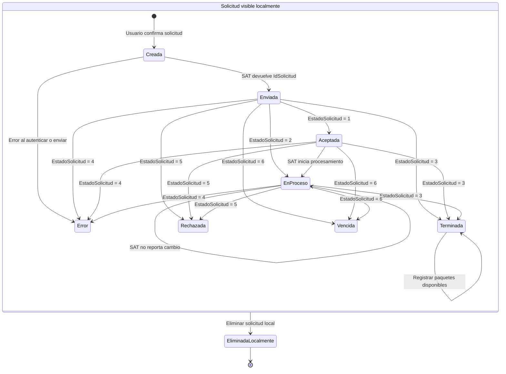
```mermaid
stateDiagram-v2
    state "Solicitud visible localmente" as Visible {
        [*] --> Creada: Usuario confirma solicitud

        Creada --> Enviada: SAT devuelve IdSolicitud
        Creada --> Error: Error al autenticar o enviar

        Enviada --> Aceptada: EstadoSolicitud = 1
        Enviada --> EnProceso: EstadoSolicitud = 2
        Enviada --> Terminada: EstadoSolicitud = 3
        Enviada --> Error: EstadoSolicitud = 4
        Enviada --> Rechazada: EstadoSolicitud = 5
        Enviada --> Vencida: EstadoSolicitud = 6

        Aceptada --> EnProceso: SAT inicia procesamiento
        Aceptada --> Terminada: EstadoSolicitud = 3
        Aceptada --> Error: EstadoSolicitud = 4
        Aceptada --> Rechazada: EstadoSolicitud = 5
        Aceptada --> Vencida: EstadoSolicitud = 6

        EnProceso --> EnProceso: SAT no reporta cambio
        EnProceso --> Terminada: EstadoSolicitud = 3
        EnProceso --> Error: EstadoSolicitud = 4
        EnProceso --> Rechazada: EstadoSolicitud = 5
        EnProceso --> Vencida: EstadoSolicitud = 6

        Terminada --> Terminada: Registrar paquetes disponibles
    }

    Visible --> EliminadaLocalmente: Eliminar solicitud local
    EliminadaLocalmente --> [*]
```

### Lectura del diagrama

- `Creada` es estado local: existe antes de que SAT devuelva `IdSolicitud`.
- `Enviada` significa que ya existe `IdSolicitud` SAT y puede ser monitoreada.
- `Aceptada`, `EnProceso`, `Terminada`, `Error`, `Rechazada` y `Vencida` reflejan `EstadoSolicitud` devuelto por SAT.
- `Terminada` no significa que los ZIP ya esten descargados. Solo significa que SAT reporto la solicitud como terminada y pueden registrarse paquetes disponibles.
- `Descargando` y `Descargado` no son estados de `SolicitudMasiva`; pertenecen a `PaqueteSolicitud`.
- `EliminadaLocalmente` representa eliminacion virtual mediante `eliminadaEn`. No toca SAT ni borra paquetes ZIP.

### Decisiones reflejadas

- El worker solo monitorea solicitudes con estado `Enviada`, `Aceptada` o `EnProceso`.
- Cuando la solicitud llega a `Terminada`, el siguiente paso es registrar paquetes disponibles, no extraer XML.
- `Error`, `Rechazada` y `Vencida` son estados terminales para monitoreo automatico de esa solicitud.
- La eliminacion local puede ocurrir desde cualquier estado visible.

### Preguntas para revisar

- Validado: debe existir el estado local `Enviada`.
- Validado: `Error` es terminal para el worker automatico; cualquier reintento debe ser accion manual.
- Validado: `Descargando` y `Descargado` quedan fuera de `SolicitudMasiva` y pertenecen a `PaqueteSolicitud`.

### 6.2 Estado de PaqueteSolicitud

Estado: validado.

Este diagrama modela el ciclo de vida local de un paquete ZIP reportado por SAT para una solicitud terminada.

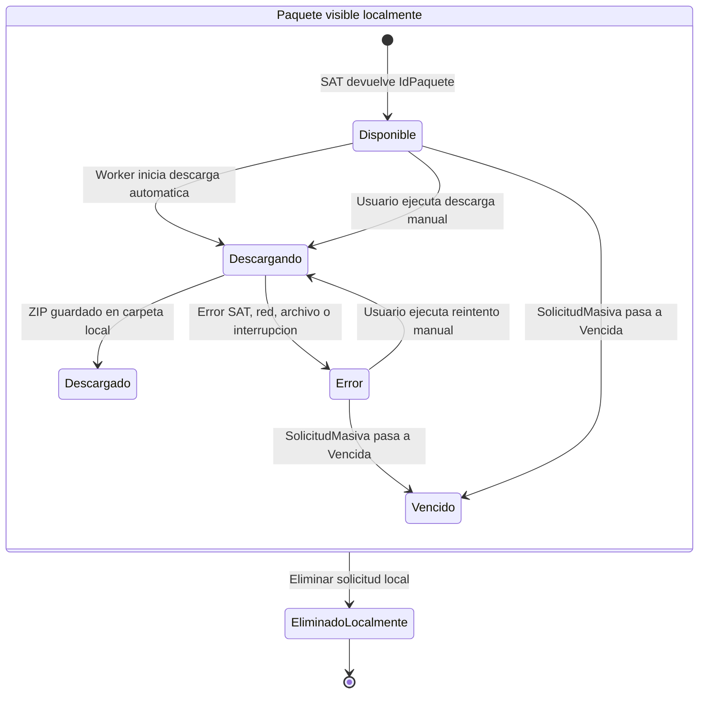
```mermaid
stateDiagram-v2
    state "Paquete visible localmente" as Visible {
        [*] --> Disponible: SAT devuelve IdPaquete

        Disponible --> Descargando: Worker inicia descarga automatica
        Disponible --> Descargando: Usuario ejecuta descarga manual

        Descargando --> Descargado: ZIP guardado en carpeta local
        Descargando --> Error: Error SAT, red, archivo o interrupcion

        Error --> Descargando: Usuario ejecuta reintento manual

        Disponible --> Vencido: SolicitudMasiva pasa a Vencida
        Error --> Vencido: SolicitudMasiva pasa a Vencida
    }

    Visible --> EliminadoLocalmente: Eliminar solicitud local
    EliminadoLocalmente --> [*]
```

### Lectura del diagrama

- `Disponible` inicia cuando la verificacion de una `SolicitudMasiva` terminada devuelve un `IdPaquete`.
- `Descargando` se asigna despues de tener token valido y justo antes de pedir el ZIP al SAT.
- `Descargado` significa que el ZIP fue guardado en la carpeta local configurada. El MVP no abre ni valida internamente el ZIP antes de marcarlo como descargado.
- `Error` registra fallas de SAT, red, escritura local o interrupcion de una descarga en curso.
- La transicion de `Error` a `Descargando` ocurre por accion manual del usuario.
- `Vencido` representa un paquete que ya no debe intentarse descargar porque su solicitud vencio antes de completar la descarga.
- `EliminadoLocalmente` es eliminacion virtual. No borra el ZIP si ya existia en disco.

### Decisiones reflejadas

- Los paquetes tienen estados propios separados de `SolicitudMasiva`.
- El worker descarga paquetes en `Disponible`, pero no reintenta automaticamente paquetes en `Error`.
- Los reintentos de paquetes fallidos son acciones manuales.
- `Vencido` evita mostrar un paquete como descargable cuando la solicitud SAT ya vencio.
- La existencia fisica del ZIP puede verificarse al abrir detalle, pero esa verificacion no cambia por si sola el estado persistido.

### Preguntas para revisar

- Validado: `Vencido` se agrega como estado de `PaqueteSolicitud`, ademas de `Vencida` en `SolicitudMasiva`.
- Validado: `Error` de paquete no se reintenta automaticamente por el worker y solo vuelve a `Descargando` por accion manual.
- Validado: si el ZIP falta en disco al abrir detalle, la UI lo muestra como archivo no encontrado sin cambiar automaticamente el estado `Descargado`.

## 7. Diagrama de despliegue local macOS

Estado: validado.

Objetivo: mostrar donde vive cada parte del MVP en el equipo local y que integraciones de macOS participan en ejecucion normal, inicio automatico, menu bar y notificaciones.

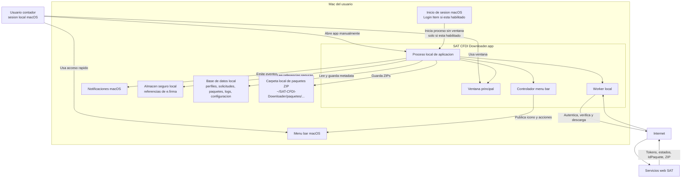
```mermaid
flowchart TB
    usuario["Usuario contador<br/>sesion local macOS"]

    subgraph mac["Mac del usuario"]
        login["Inicio de sesion macOS<br/>Login Item si esta habilitado"]
        menu_bar["Menu bar macOS"]
        notification_center["Notificaciones macOS"]

        subgraph bundle["SAT CFDI Downloader.app"]
            process["Proceso local de aplicacion"]
            ui["Ventana principal"]
            menu_controller["Controlador menu bar"]
            worker["Worker local"]
        end

        secure_store["Almacen seguro local<br/>referencias de e.firma"]
        local_db["Base de datos local<br/>perfiles, solicitudes, paquetes, logs, configuracion"]
        package_folder["Carpeta local de paquetes ZIP<br/>~/SAT-CFDI-Downloader/paquetes/..."]
    end

    internet["Internet"]
    sat["Servicios web SAT"]

    usuario -->|"Abre app manualmente"| process
    usuario -->|"Usa ventana"| ui
    usuario -->|"Usa acceso rapido"| menu_bar

    login -->|"Inicia proceso sin ventana<br/>solo si esta habilitado"| process

    process --> ui
    process --> menu_controller
    process --> worker

    menu_controller -->|"Publica icono y acciones"| menu_bar
    process -->|"Emite eventos"| notification_center

    process -->|"Lee y guarda metadata"| local_db
    process -->|"Lee referencias seguras"| secure_store
    process -->|"Guarda ZIPs"| package_folder

    worker -->|"Autentica, verifica y descarga"| internet
    internet --> sat
    sat -->|"Tokens, estados, IdPaquete, ZIP"| internet
    internet --> worker
```

### Lectura del diagrama

- Todo corre en el Mac del usuario, dentro de su sesion local.
- `SAT CFDI Downloader.app` es una aplicacion local con un solo proceso principal para UI, menu bar y worker.
- El inicio automatico usa la integracion normal de macOS y solo levanta el proceso con icono de menu bar; no abre la ventana principal.
- Al abrir la app manualmente, se muestra la ventana principal aunque el proceso ya exista.
- La base de datos local guarda metadata operativa; la carpeta local guarda paquetes ZIP.
- Los logs operativos se guardan en la base de datos local; no se modela un almacenamiento separado de logs tecnicos para el MVP.
- El almacen seguro local guarda o protege secretos de e.firma mediante un contrato de seguridad, sin fijar implementacion concreta en este diagrama.
- Las notificaciones pasan por macOS.
- La unica comunicacion externa de negocio es con SAT a traves de internet.

### Decisiones reflejadas

- Despliegue personal, local-first y sin backend remoto.
- No hay servicio del sistema compartido, daemon multiusuario ni proceso para terceros.
- El worker depende de que el proceso local de la app este ejecutandose.
- La separacion entre base local, carpeta de ZIPs y almacen seguro queda explicita.
- La base local es el unico almacenamiento de logs del MVP.
- El modo de inicio automatico no cambia el alcance: solo mantiene monitoreo local para el mismo usuario.
- La app no se modela como daemon, LaunchAgent independiente ni app `LSUIElement` permanente.

### Preguntas para revisar

- Validado: `SAT CFDI Downloader.app` se modela como un solo proceso local con UI, menu bar y worker.
- Validado: la base local es el unico almacenamiento de logs del MVP.
- Validado: el worker solo existe mientras corre el proceso de la app; no es daemon independiente de macOS.

## 8. Diagrama de seguridad: credenciales, tokens y logs

Estado: validado.

Objetivo: fijar las fronteras de seguridad para e.firma, llave privada, contrasena, tokens SAT y logs. La frontera se mantiene como contrato `SecretStore`; `ADR 0010` define Keychain como adaptador inicial de macOS y token SAT solo en memoria.

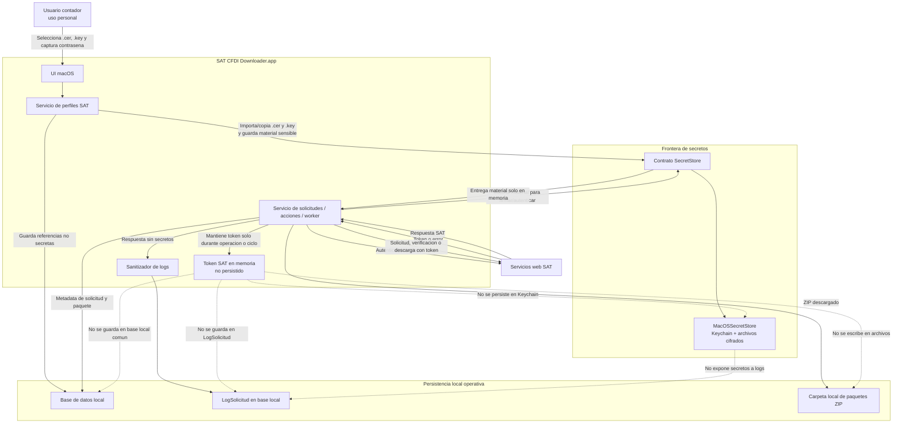
```mermaid
flowchart TB
    usuario["Usuario contador<br/>uso personal"]

    subgraph app["SAT CFDI Downloader.app"]
        ui["UI macOS"]
        profiles["Servicio de perfiles SAT"]
        requests["Servicio de solicitudes / acciones / worker"]
        sanitizer["Sanitizador de logs"]
        token_memory["Token SAT en memoria<br/>no persistido"]
    end

    subgraph secure_boundary["Frontera de secretos"]
        credentials_contract["Contrato SecretStore"]
        secure_store["MacOSSecretStore<br/>Keychain + archivos cifrados"]
    end

    subgraph local_persistence["Persistencia local operativa"]
        db["Base de datos local"]
        logs["LogSolicitud en base local"]
        package_folder["Carpeta local de paquetes ZIP"]
    end

    sat["Servicios web SAT"]

    usuario -->|"Selecciona .cer, .key y captura contrasena"| ui
    ui --> profiles
    profiles -->|"Importa/copia .cer y .key<br/>y guarda material sensible"| credentials_contract
    credentials_contract --> secure_store
    profiles -->|"Guarda referencias no secretas"| db

    requests -->|"Solicita material para firmar/autenticar"| credentials_contract
    credentials_contract -->|"Entrega material solo en memoria"| requests
    requests -->|"Autentica con e.firma"| sat
    sat -->|"Token o error"| requests
    requests -->|"Mantiene token solo durante operacion o ciclo"| token_memory

    requests -->|"Solicitud, verificacion o descarga con token"| sat
    sat -->|"Respuesta SAT"| requests
    requests -->|"Respuesta sin secretos"| sanitizer
    sanitizer --> logs

    requests -->|"Metadata de solicitud y paquete"| db
    requests -->|"ZIP descargado"| package_folder

    token_memory -. "No se guarda en base local comun" .-> db
    token_memory -. "No se guarda en LogSolicitud" .-> logs
    token_memory -. "No se escribe en archivos" .-> package_folder
    token_memory -. "No se persiste en Keychain" .-> secure_store
    secure_store -. "No expone secretos a logs" .-> logs
```

### Lectura del diagrama

- La UI recibe archivos y contrasena de e.firma, pero no los persiste directamente.
- Al registrar e.firma, la aplicacion importa/copia `.cer` y `.key` al almacenamiento controlado por la aplicacion.
- `CredencialSat` en la base local debe guardar referencias no secretas al contrato de secretos seguros.
- El material sensible de e.firma vive dentro de la frontera de secretos implementada por `MacOSSecretStore`.
- El servicio que autentica o firma recibe material sensible solo para la operacion actual.
- El token SAT vive solo en memoria del proceso mientras dura la operacion o ciclo actual.
- El token SAT no se persiste en base local, logs, archivos ni Keychain.
- `LogSolicitud` vive en la base local, pero debe pasar por sanitizacion antes de guardar payloads de diagnostico.
- Los paquetes ZIP descargados son informacion sensible, pero pertenecen a la carpeta local de paquetes, no al almacen de credenciales.

### Decisiones reflejadas

- Se modela almacenamiento seguro por contrato; Keychain es el adaptador inicial para macOS.
- No se guardan contrasenas, llaves privadas ni tokens en texto plano.
- `.cer` y `.key` se importan o copian al almacenamiento controlado por la aplicacion.
- La llave privada importada queda cifrada en reposo; el secreto para descifrarla vive en Keychain.
- El token SAT no se persiste en el MVP.
- No se registran secretos en `LogSolicitud`.
- La base local guarda metadata y referencias, no secretos.
- El MVP sigue siendo local y personal; no introduce permisos, cuentas ni servidor remoto.

### Preguntas para revisar

- Validado: al registrar e.firma, la app importa/copia `.cer` y `.key` al almacenamiento controlado por la aplicacion.
- Validado por `ADR 0010`: el token SAT solo vive en memoria para el MVP.
- Validado: `LogSolicitud` guarda peticiones/respuestas SAT sanitizadas, no payloads literalmente crudos si contienen token, firma o secretos.

## 9. Contratos internos

Estado: validado.

Objetivo: definir las fronteras que los servicios de aplicacion usan para hablar con SAT, secretos, base local, carpeta de paquetes y macOS. Estos contratos describen capacidades esperadas, no clases finales ni tecnologia concreta.

```mermaid
classDiagram
    class SatGateway {
        <<contract>>
        +autenticar(materialFirma) TokenSat
        +crearSolicitud(filtrosSat, token) RespuestaSolicitud
        +verificarSolicitud(idSolicitudSat, rfcSolicitante, token) RespuestaVerificacion
        +descargarPaquete(idPaqueteSat, token) PaqueteZip
    }

    class SecretStore {
        <<contract>>
        +importarEFirma(perfilSatId, certificado, llavePrivada, contrasena) CredencialRef
        +obtenerMaterialFirma(credencialRef) MaterialFirma
        +eliminarSecretos(perfilSatId)
    }

    class MacOSSecretStore {
        <<adapter>>
    }

    class SolicitudRepository {
        <<contract>>
        +guardarSolicitud(solicitud) SolicitudMasiva
        +actualizarSolicitud(solicitud)
        +buscarSolicitudesParaVerificar(fechaActual) SolicitudMasiva[]
        +buscarActivaPorFiltros(perfilSatId, filtrosSat) SolicitudMasiva?
        +buscarPorId(id) SolicitudMasiva?
        +marcarEliminada(id, fecha)
    }

    class PaqueteRepository {
        <<contract>>
        +registrarPaquetes(solicitudId, idsPaqueteSat) PaqueteSolicitud[]
        +buscarPaquetesDisponibles() PaqueteSolicitud[]
        +buscarPaquetesParaReintento(solicitudId) PaqueteSolicitud[]
        +actualizarPaquete(paquete)
        +marcarNoDescargadosComoVencidos(solicitudId, fecha)
        +marcarEliminadosPorSolicitud(solicitudId, fecha)
    }

    class LogSolicitudRepository {
        <<contract>>
        +agregarLog(logSanitizado)
        +listarPorSolicitud(solicitudId) LogSolicitud[]
        +marcarEliminadosPorSolicitud(solicitudId, fecha)
    }

    class ConfiguracionRepository {
        <<contract>>
        +obtenerConfiguracion() ConfiguracionApp
        +guardarConfiguracion(configuracion)
        +guardarEstadoCierre(fecha)
    }

    class PackageStorage {
        <<contract>>
        +construirRuta(solicitud, paquete) RutaLocal
        +guardarZip(ruta, paqueteZip)
        +existeZip(ruta) bool
    }

    class OSIntegration {
        <<contract>>
        +configurarLoginItem(habilitado)
        +mostrarIconoMenuBar()
        +actualizarEstadoMenuBar(estadoWorker)
        +mostrarVentanaPrincipal()
        +ocultarVentanaPrincipal()
        +notificar(evento)
    }

    class MacOSIntegration {
        <<adapter>>
    }

    class LogSanitizer {
        <<contract>>
        +sanitizarPeticion(payload) PayloadSanitizado
        +sanitizarRespuesta(payload) PayloadSanitizado
    }

    class ServicioSolicitudes {
        <<application>>
    }

    class ServicioAcciones {
        <<application>>
    }

    class ServicioConsultaLocal {
        <<application>>
    }

    class WorkerLocal {
        <<application>>
    }

    ServicioSolicitudes --> SatGateway
    ServicioSolicitudes --> SecretStore
    ServicioSolicitudes --> SolicitudRepository
    ServicioSolicitudes --> LogSolicitudRepository
    ServicioSolicitudes --> LogSanitizer

    ServicioAcciones --> SatGateway
    ServicioAcciones --> SecretStore
    ServicioAcciones --> SolicitudRepository
    ServicioAcciones --> PaqueteRepository
    ServicioAcciones --> PackageStorage
    ServicioAcciones --> OSIntegration
    ServicioAcciones --> LogSolicitudRepository
    ServicioAcciones --> LogSanitizer

    ServicioConsultaLocal --> SolicitudRepository
    ServicioConsultaLocal --> PaqueteRepository
    ServicioConsultaLocal --> LogSolicitudRepository
    ServicioConsultaLocal --> PackageStorage

    WorkerLocal --> SatGateway
    WorkerLocal --> SecretStore
    WorkerLocal --> SolicitudRepository
    WorkerLocal --> PaqueteRepository
    WorkerLocal --> PackageStorage
    WorkerLocal --> OSIntegration
    WorkerLocal --> ConfiguracionRepository
    WorkerLocal --> LogSolicitudRepository
    WorkerLocal --> LogSanitizer

    MacOSSecretStore ..|> SecretStore
    MacOSIntegration ..|> OSIntegration
```

### Lectura del diagrama

- `SatGateway` encapsula el servicio web SAT: autenticar, crear solicitud, verificar estado y descargar paquete.
- `crearSolicitud` y `descargarPaquete` se especifican en `docs/web-service.md`, usando la fuente canonica aceptada en `ADR 0005`.
- `SecretStore` encapsula e.firma. La base local solo debe guardar referencias no secretas.
- `MacOSSecretStore` es el adaptador inicial basado en Keychain y archivos cifrados controlados por la app.
- Los repositorios separan responsabilidades: solicitudes, paquetes, logs y configuracion.
- `PackageStorage` solo maneja rutas y ZIPs. No extrae, parsea ni indexa XML.
- `OSIntegration` cubre Login Item, menu bar, ventana principal y notificaciones.
- `MacOSIntegration` es el adaptador inicial que cumple `OSIntegration` para el MVP en macOS.
- La activacion foreground/background de macOS queda dentro de `OSIntegration`.
- `LogSanitizer` es obligatorio antes de persistir payloads de peticiones/respuestas SAT en `LogSolicitud`.
- Los servicios de aplicacion dependen de contratos, no de adaptadores concretos.

### Decisiones reflejadas

- Se conserva separacion entre `ServicioSolicitudes`, `ServicioAcciones`, `ServicioConsultaLocal` y `WorkerLocal`.
- Los tokens SAT no se persisten en el MVP; viven solo en memoria del proceso.
- La descarga de paquetes queda modelada a nivel ZIP.
- La verificacion de existencia del ZIP se expone como contrato de almacenamiento, pero no modifica automaticamente el estado persistido.
- La configuracion local queda en un contrato propio porque controla pausa, autostart y cierre de app.
- La integracion con sistema operativo se modela como `OSIntegration`; macOS es solo el adaptador actual.
- `LogSanitizer` queda como contrato explicito.
- `OSIntegration` incluye mostrar y ocultar la ventana principal.

### Preguntas para revisar

- Validado: la separacion de repositorios en solicitudes, paquetes, logs y configuracion es correcta.
- Validado: `LogSanitizer` queda como contrato explicito.
- Validado: el contrato debe llamarse `OSIntegration`; `MacOSIntegration` es el adaptador inicial que lo cumple.
- Validado: `OSIntegration` incluye `mostrarVentanaPrincipal` y `ocultarVentanaPrincipal`.

## 10. Diagrama de navegacion UI

Estado: validado.

Objetivo: mostrar como se mueve el usuario entre las vistas del MVP. Este diagrama solo cubre navegacion visible; no modela procesamiento SAT ni persistencia interna.

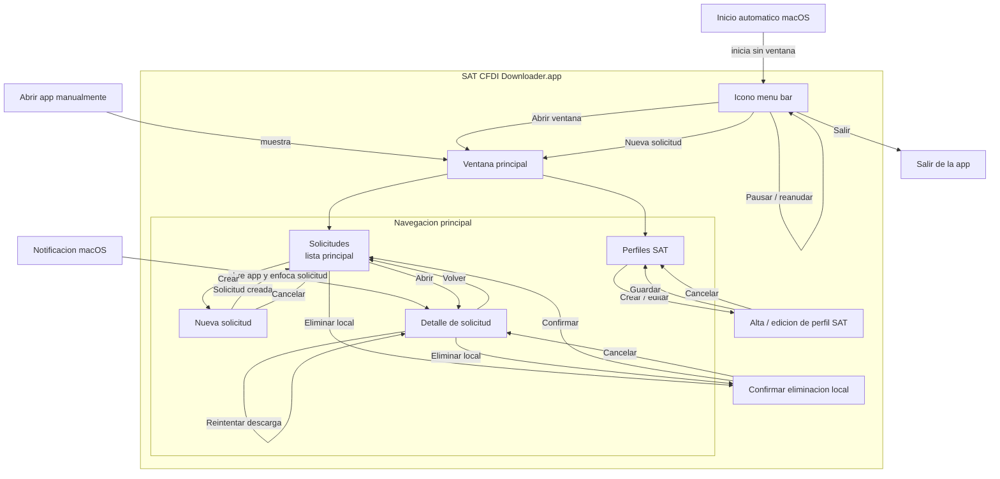
```mermaid
flowchart TB
    manual_open["Abrir app manualmente"]
    autostart["Inicio automatico macOS"]
    notification["Notificacion macOS"]

    subgraph app["SAT CFDI Downloader.app"]
        menu_bar["Icono menu bar"]
        main_window["Ventana principal"]

        subgraph main["Navegacion principal"]
            requests_list["Solicitudes<br/>lista principal"]
            new_request["Nueva solicitud"]
            request_detail["Detalle de solicitud"]
            profiles["Perfiles SAT"]
        end

        profile_form["Alta / edicion de perfil SAT"]
        confirm_delete["Confirmar eliminacion local"]
    end

    manual_open -->|"muestra"| main_window
    autostart -->|"inicia sin ventana"| menu_bar
    notification -->|"abre app y enfoca solicitud"| request_detail

    menu_bar -->|"Abrir ventana"| main_window
    menu_bar -->|"Nueva solicitud"| main_window
    menu_bar -->|"Habilitar / deshabilitar inicio automatico"| menu_bar
    menu_bar -->|"Pausar / reanudar"| menu_bar
    menu_bar -->|"Salir"| exit_app["Salir de la app"]

    main_window --> requests_list
    main_window --> profiles

    requests_list -->|"Crear"| new_request
    requests_list -->|"Abrir"| request_detail
    requests_list -->|"Eliminar local"| confirm_delete

    request_detail -->|"Verificar ahora"| request_detail
    request_detail -->|"Reintentar descarga"| request_detail
    request_detail -->|"Eliminar local"| confirm_delete
    request_detail -->|"Volver"| requests_list

    new_request -->|"Solicitud creada"| requests_list
    new_request -->|"Cancelar"| requests_list

    profiles -->|"Crear / editar"| profile_form
    profile_form -->|"Guardar"| profiles
    profile_form -->|"Cancelar"| profiles

    confirm_delete -->|"Confirmar"| requests_list
    confirm_delete -->|"Cancelar"| request_detail
```

### Lectura del diagrama

- La apertura manual siempre muestra la ventana principal.
- El inicio automatico solo muestra el icono de menu bar y mantiene el worker segun configuracion.
- La pantalla principal es `Solicitudes`; desde ahi se crea una nueva solicitud o se abre el detalle.
- `Nueva solicitud` es una pantalla dentro de la ventana principal.
- `Detalle de solicitud` concentra acciones manuales sobre una solicitud existente.
- `Perfiles SAT` permite alta y edicion de perfiles/e.firma.
- El MVP no incluye pantalla de `Preferencias`; inicio automatico y pausa/reanudacion se controlan desde el menu bar.
- La ruta de paquetes queda fija en el MVP.
- El menu bar da accesos rapidos sin reemplazar la ventana principal.
- Las notificaciones abren la app y enfocan el detalle de la solicitud relacionada.

### Decisiones reflejadas

- No hay pantallas de usuarios, clientes, roles ni administracion comercial.
- La UI gira alrededor de solicitudes y perfiles SAT.
- La eliminacion local requiere confirmacion.
- Las acciones manuales no llevan a pantallas separadas; actualizan el detalle/lista.
- La app puede ser abierta desde menu bar, apertura manual o notificacion.
- Las opciones de inicio automatico y pausa/reanudacion viven en el menu bar.

### Preguntas para revisar

- Validado: `Nueva solicitud` es una pantalla dentro de la ventana principal.
- Validado: no existe pantalla de `Preferencias` en el MVP; inicio automatico y pausa viven en el menu bar.
- Validado: al hacer clic en una notificacion, se abre el detalle de la solicitud relacionada.

## 11. Esquema logico de base local

Estado: validado.

Objetivo: definir la estructura logica de persistencia local para el MVP. Este diagrama no decide motor de base de datos; solo fija entidades, relaciones, campos principales y restricciones esperadas.

```mermaid
erDiagram
    PERFIL_SAT ||--|| CREDENCIAL_SAT : tiene
    PERFIL_SAT ||--o{ SOLICITUD_MASIVA : agrupa
    SOLICITUD_MASIVA ||--o{ PAQUETE_SOLICITUD : contiene
    SOLICITUD_MASIVA ||--o{ LOG_SOLICITUD : registra

    PERFIL_SAT {
        string id PK
        string rfc UK
        string nombre
        boolean activo
        datetime creado_en
        datetime actualizado_en
        datetime eliminado_en
    }

    CREDENCIAL_SAT {
        string id PK
        string perfil_sat_id FK
        string certificado_ref
        string llave_privada_ref
        string contrasena_ref
        datetime registrada_en
        datetime actualizada_en
    }

    SOLICITUD_MASIVA {
        string id PK
        string perfil_sat_id FK
        string id_solicitud_sat UK
        string tipo_cfdi
        string tipo_solicitud
        date fecha_inicial
        date fecha_final
        string filtros_sat_json
        string estado
        string codigo_sat
        string mensaje_sat
        int numero_cfdi
        datetime creada_en
        datetime enviada_en
        datetime ultima_verificacion_en
        datetime siguiente_verificacion_en
        int verificaciones_sin_cambio
        string ultimo_error
        string accion_pendiente
        datetime accion_pendiente_en
        datetime eliminada_en
    }

    PAQUETE_SOLICITUD {
        string id PK
        string solicitud_masiva_id FK
        string id_paquete_sat
        string estado_descarga
        string ruta_local
        datetime disponible_en
        datetime descargado_en
        datetime vencimiento_estimado_en
        string ultimo_error
        datetime eliminado_en
    }

    LOG_SOLICITUD {
        string id PK
        string solicitud_masiva_id FK
        string tipo_evento
        string origen
        string codigo_sat
        string mensaje_sat
        string payload_resumen_json
        datetime creado_en
        datetime eliminado_en
    }

    CONFIGURACION_APP {
        string id PK
        boolean inicio_automatico_habilitado
        boolean monitoreo_pausado
        datetime ultimo_cierre_en
        datetime actualizada_en
    }
```

### Lectura del diagrama

- `PERFIL_SAT` representa un RFC/contribuyente operado por el usuario local.
- `CREDENCIAL_SAT` tiene relacion uno a uno con `PERFIL_SAT` y guarda solo referencias no secretas.
- `SOLICITUD_MASIVA` es la entidad central de la app: contiene filtros, estado SAT/local y programacion de monitoreo.
- `PAQUETE_SOLICITUD` representa ZIPs reportados o descargados; no representa XML individuales.
- `LOG_SOLICITUD` guarda eventos sanitizados de una solicitud.
- `CONFIGURACION_APP` no se relaciona con una entidad de usuario porque la app es personal y corre en una sesion local.
- La eliminacion local se implementa con `eliminado_en`; las consultas normales deben ocultar registros eliminados.

### Restricciones e indices esperados

- `PERFIL_SAT.rfc` debe ser unico entre perfiles activos/no eliminados.
- `CREDENCIAL_SAT.perfil_sat_id` debe ser unico para mantener una credencial activa por perfil.
- `SOLICITUD_MASIVA.id_solicitud_sat` debe ser unico cuando exista; antes de enviar a SAT puede estar vacio.
- Debe existir una restriccion logica o indice unico parcial para impedir solicitudes activas equivalentes por `perfil_sat_id` + filtros SAT relevantes.
- `PAQUETE_SOLICITUD` debe tener unicidad por `solicitud_masiva_id` + `id_paquete_sat`.
- `CONFIGURACION_APP` debe manejarse como registro unico de configuracion local.
- Indice para monitoreo: `SOLICITUD_MASIVA.estado`, `siguiente_verificacion_en`, `eliminada_en`.
- Indice para descarga: `PAQUETE_SOLICITUD.estado_descarga`, `eliminado_en`.
- Indice para detalle: `LOG_SOLICITUD.solicitud_masiva_id`, `creado_en`.

### Decisiones reflejadas

- No hay tabla de usuarios, clientes, roles, organizaciones ni permisos.
- No hay tabla de CFDI/XML ni UUID de comprobante en el MVP.
- La base local guarda metadata, logs sanitizados y referencias a secretos, no secretos.
- La carpeta de ZIPs sigue fuera de la base de datos; la base solo guarda `ruta_local`.
- La accion manual pendiente vive dentro de `SOLICITUD_MASIVA`, no en una tabla separada.
- Una sola credencial activa por `PERFIL_SAT`.
- `PERFIL_SAT.rfc` unico entre perfiles activos/no eliminados.
- `CONFIGURACION_APP` como registro unico local.

### Preguntas para revisar

- Validado: una sola credencial activa por `PerfilSat`, reemplazable al actualizar e.firma.
- Validado: `PerfilSat.rfc` debe ser unico entre perfiles activos/no eliminados.
- Validado: `ConfiguracionApp` debe ser un registro unico local.

## 12. Riesgos y decisiones pendientes

Estado: en revision.

Estos puntos no amplian el alcance del MVP. Sirven para no convertir supuestos tecnicos en decisiones finales antes de implementacion.

### 12.1 Contratos SAT documentados

- `ADR 0005` acepta la documentacion oficial SAT como fuente canonica para `SolicitaDescarga` y `DescargaMasiva`.
- `docs/web-service.md` ya contiene la especificacion local inicial de autenticacion, solicitud, verificacion y descarga.
- `ADR 0008` define el mapeo entre la UI del MVP y los atributos SAT de `SolicitaDescarga`.
- La implementacion todavia debe validarse con pruebas reales contra SAT, especialmente omision de atributos vacios, estructura exacta de `RfcReceptores` y manejo de errores operativos.

### 12.2 Riesgos macOS especificos

- `ADR 0009` decide usar activacion por contexto: foreground al abrir manualmente y background/menu bar al iniciar por Login Item.
- Login Items puede requerir aprobacion explicita del usuario en macOS. `OSIntegration.configurarLoginItem` debe representar estados como habilitado, pendiente, rechazado o no disponible.
- Las notificaciones nativas pueden ser rechazadas por el usuario. La UI debe poder mostrar que las notificaciones estan deshabilitadas sin romper el flujo principal.
- `ADR 0010` decide usar Keychain mediante `MacOSSecretStore`; puede haber prompts o rechazos del sistema al registrar o usar e.firma.

### 12.3 Decisiones conscientes ya tomadas

- La aplicacion sigue siendo de uso personal; no se agregan usuarios, clientes, roles ni backend remoto por escenarios comerciales hipoteticos.
- Las acciones manuales con monitoreo pausado quedan pendientes en `SolicitudMasiva`, porque esa fue la decision de alcance vigente.
- `ServicioAcciones` se conserva separado de `ServicioSolicitudes`; una implementacion futura puede compartir logica interna con el worker sin cambiar el modelo.
- `ADR 0010` decide que el token SAT vive solo en memoria para el MVP.
- `LogSanitizer` se mantiene como contrato explicito antes de guardar payloads SAT en `LogSolicitud`.
