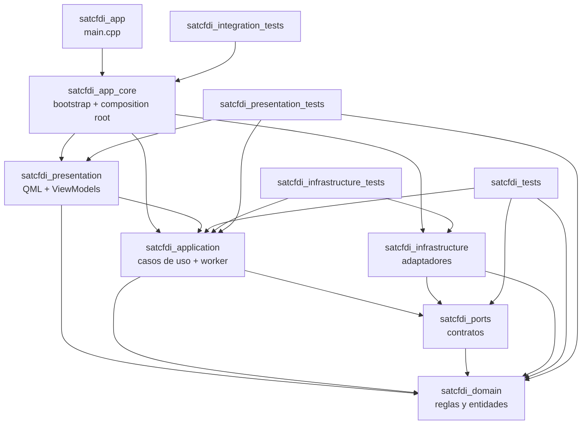

# Estructura Qt/CMake

Estado: borrador listo para implementar M1.

## Objetivo

Definir la estructura fisica inicial del proyecto Qt para implementar el MVP personal sin mezclar UI, reglas de negocio, persistencia, archivos, secretos e integracion SAT.

Este diseno asume `ADR 0011`: Qt 6, QML / Qt Quick Controls, C++ y CMake.

## Baseline tecnico

- Qt: 6.8 LTS como baseline recomendado para mantenimiento largo. No usar APIs que requieran una version mayor sin actualizar este documento.
- Build: CMake.
- Lenguaje: C++20.
- UI: QML con Qt Quick Controls.
- App event loop: `QApplication`, porque el MVP usa `QSystemTrayIcon` para menu bar/system tray.
- Base local: SQLite detras de repositorios.
- Tests: Qt Test para dominio y aplicacion.

## Targets CMake

| Target | Tipo | Responsabilidad | Dependencias permitidas |
| --- | --- | --- | --- |
| `satcfdi_domain` | static lib | Entidades, estados, filtros normalizados, reglas de transicion y retencion local. | `Qt6::Core` |
| `satcfdi_ports` | interface lib | Contratos C++: SAT, secretos, repositorios, paquetes, SO y sanitizacion. | `satcfdi_domain` |
| `satcfdi_application` | static lib | Casos de uso, servicios de aplicacion, dispatcher de persistencia, sanitizacion de logs, ejecutor serial futuro, worker y acciones manuales. | `satcfdi_domain`, `satcfdi_ports`, `Qt6::Core` |
| `satcfdi_infrastructure` | static lib | Adaptadores SQLite, SAT, archivos, macOS, Keychain y notificaciones. En T003 agrega migrador, proveedor SQLite y repositorios. | `satcfdi_domain`, `satcfdi_ports`, `Qt6::Core`; `Qt6::Sql` solo cuando implementa persistencia; los adaptadores posteriores agregan `Qt6::Network` o `Qt6::Widgets` cuando corresponda |
| `satcfdi_presentation` | static lib / qml module | View models C++ y QML expuesto por la app. | `satcfdi_application`, `satcfdi_domain`, `Qt6::Core`, `Qt6::Qml`, `Qt6::Quick`, `Qt6::QuickControls2` |
| `satcfdi_app_core` | static lib | `AppBootstrapper`, `AppCompositionRoot`, resolucion de rutas y armado del grafo para app y pruebas de integracion. | `satcfdi_presentation`, `satcfdi_application`, `satcfdi_infrastructure`, `Qt6::Core` |
| `satcfdi_app` | executable `MACOSX_BUNDLE` | `main.cpp`, `QApplication`, argumentos, bundle macOS. | `satcfdi_app_core`, `Qt6::Widgets`, `Qt6::Quick` |
| `satcfdi_tests` | test executable | Tests unitarios de dominio y aplicacion con fakes. | `satcfdi_domain`, `satcfdi_application`, `satcfdi_ports`, `Qt6::Test` |
| `satcfdi_infrastructure_tests` | test executable | Tests SQLite, migraciones, repositorios, PRAGMAs, cierre y restricciones con bases temporales. | `satcfdi_infrastructure`, `satcfdi_application`, `satcfdi_ports`, `Qt6::Sql`, `Qt6::Test` |
| `satcfdi_integration_tests` | test executable | Pruebas de composition root, reinicio con base temporal y ausencia de servicios demo productivos. | `satcfdi_app_core`, `Qt6::Test` |
| `satcfdi_presentation_tests` | test executable | Tests de carga QML, roles de modelos, navegacion y estados con servicios fake asincronos. | `satcfdi_presentation`, `satcfdi_application`, `satcfdi_domain`, `Qt6::Test`, `Qt6::QuickTest` |

## Dependencias permitidas



Reglas:

- `domain` no conoce Qt Quick, QML, SQL, red, archivos, Keychain ni macOS.
- `application` no instancia adaptadores concretos. Solo usa contratos.
- `infrastructure` no decide flujos de negocio. Solo implementa contratos.
- `presentation` no ejecuta SQL, SOAP, filesystem ni Keychain directamente.
- `satcfdi_app_core` arma el grafo de objetos concretos para que pueda probarse sin enlazar contra el ejecutable.
- `satcfdi_app` solo contiene `main.cpp`, `QApplication`, argumentos y comportamiento propio del bundle.

## Arbol objetivo M1 de carpetas

Este arbol describe la forma objetivo del milestone M1. T002 solo crea el
subconjunto necesario para el shell Qt/QML ejecutable. Las carpetas de SQLite,
adaptadores SAT, archivos, macOS, secretos y UI de perfiles pueden quedar vacias
o ausentes hasta sus tareas correspondientes.

```text
.
├── CMakeLists.txt
├── cmake/
│   └── warnings.cmake
├── resources/
│   ├── icons/
│   └── macos/
│       └── Info.plist.in
├── src/
│   ├── app/
│   │   ├── main.cpp
│   │   ├── AppBootstrapper.h
│   │   ├── AppBootstrapper.cpp
│   │   ├── AppCompositionRoot.h
│   │   └── AppCompositionRoot.cpp
│   ├── domain/
│   │   ├── common/
│   │   ├── perfiles/
│   │   ├── solicitudes/
│   │   ├── paquetes/
│   │   └── sat/
│   ├── ports/
│   │   ├── SatGateway.h
│   │   ├── SecretStore.h
│   │   ├── OSIntegration.h
│   │   ├── PackageStorage.h
│   │   ├── LogSanitizer.h
│   │   └── repositories/
│   ├── application/
│   │   ├── profiles/
│   │   ├── requests/
│   │   ├── actions/
│   │   ├── execution/
│   │   ├── worker/
│   │   └── logging/
│   ├── infrastructure/
│   │   ├── persistence/
│   │   │   ├── sqlite/
│   │   │   └── migrations/
│   │   │       └── 001_initial_schema.sql   # T001/T003
│   │   ├── sat/
│   │   ├── storage/
│   │   ├── os/
│   │   │   └── macos/
│   │   └── secrets/
│   │       └── macos/
│   └── presentation/
│       ├── qml/
│       │   ├── Main.qml
│       │   ├── components/
│       │   └── screens/
│       │       ├── SolicitudesPage.qml
│       │       ├── NuevaSolicitudPage.qml
│       │       └── DetalleSolicitudPage.qml
│       └── viewmodels/
│           ├── AppViewModel.h
│           ├── SolicitudesListModel.h
│           ├── SolicitudDetailViewModel.h
│           ├── NuevaSolicitudViewModel.h
│           └── PerfilesSatViewModel.h       # T005.1
└── tests/
    ├── unit/
    ├── infrastructure/
    ├── integration/
    ├── presentation/
    └── fakes/
```

Subconjunto T002:

- No crea `001_initial_schema.sql`, migraciones ni adaptadores SQLite.
- No crea `PerfilesSatPage.qml` ni `PerfilesSatViewModel.h`.
- Puede crear carpetas vacias o targets minimos cuando CMake lo requiera, pero
  sin implementaciones productivas fuera del shell.
- `NuevaSolicitudViewModel` expone un modelo demo de perfiles activos para el
  selector de formulario.

Subconjunto T003:

- Agrega `Qt6::Sql` solo a `satcfdi_infrastructure`.
- Agrega `satcfdi_app_core` para probar bootstrap y composition root sin enlazar
  contra el ejecutable.
- Agrega `satcfdi_infrastructure_tests` y `satcfdi_integration_tests`.
- Consume `src/infrastructure/persistence/migrations/001_initial_schema.sql`
  como recurso `:/migrations/001_initial_schema.sql`.
- Reemplaza el servicio demo en el composition root por servicios persistidos,
  pero conserva fakes para pruebas de presentacion.

## QML y C++

QML debe tratarse como capa de presentacion. Sus responsabilidades son:

- Layout.
- Navegacion.
- Estados visuales.
- Validacion superficial de formulario.
- Invocar comandos de view models.

Los view models C++ deben exponer:

- Propiedades observables con `Q_PROPERTY`.
- Comandos invocables con `Q_INVOKABLE` o slots.
- Listas mediante `QAbstractListModel`.
- Senales para cambios de estado, errores visibles y navegacion.

QML no debe importar ni usar:

- Repositorios.
- Adaptadores SAT.
- `QSqlDatabase` o queries SQL.
- Keychain/SecretStore.
- `QFile` para paquetes ZIP.

## Asincronia y reglas de hilos

La UI QML corre en el hilo grafico. Ninguna llamada SAT, escritura SQLite, acceso a Keychain o escritura de ZIP debe bloquear ese hilo.

Reglas:

- `PersistenceDispatcher` es el mecanismo tecnico de T003 para ejecutar
  persistencia local fuera del hilo grafico. Vive sobre un `QThread` dedicado y
  devuelve resultados mediante `QPromise`/`QFuture` o senales encoladas.
- `PersistenceDispatcher` no es `OperacionExecutor`. T007 introducira el
  ejecutor serial para operaciones SAT, worker, recuperacion y acciones
  manuales criticas.
- `OperacionExecutor` vive en un hilo de trabajo o usa una cola serial fuera del hilo grafico.
- Worker y acciones manuales encolan operaciones en `OperacionExecutor`; no ejecutan directamente SAT, transacciones ni escrituras de ZIP.
- Cada hilo que use SQLite debe tener su propia conexion `QSqlDatabase`.
- Los repositorios no deben compartir una conexion abierta entre hilo grafico y ejecutor.
- Las transacciones SQLite de escritura usan `BEGIN IMMEDIATE` mediante `UnitOfWork` para evitar carreras lectura-escritura con WAL.
- Los modelos visuales basados en `QAbstractListModel` se actualizan en el hilo grafico.
- Los resultados del ejecutor o dispatcher regresan a view models mediante signals/slots con conexion encolada, `QFuture::then(viewModel, ...)` o un mecanismo equivalente seguro para Qt.
- La eliminacion local debe verificarse antes de aplicar cualquier resultado asincrono a una solicitud o paquete.

## Modulo QML

El ejecutable debe declarar un modulo QML propio con `qt_add_qml_module`.

URI sugerido:

```text
SatCfdiDownloader
```

La app debe usar `qt_standard_project_setup(REQUIRES 6.8)` para activar defaults modernos de CMake/Qt y mantener los recursos QML bajo rutas estables.

## Menu bar/system tray

El MVP debe implementar el icono de menu bar/system tray desde C++ usando `QSystemTrayIcon`.

Motivos:

- Es una API estable de Qt Widgets.
- Funciona en macOS y Windows.
- Permite mantener la ventana QML separada del control de ciclo de vida.
- Evita depender de `Qt.labs.platform.SystemTrayIcon` para una funcion central del MVP.

Consecuencia tecnica: `main.cpp` debe crear `QApplication`, no solo `QGuiApplication`.

T002 usa `QApplication` para quedar alineada con esta decision futura, pero no
implementa `QSystemTrayIcon`, cierre a segundo plano, instancia unica,
`LSUIElement`, autostart ni notificaciones. Ese comportamiento pertenece a T004.
Mientras T004 no exista, cerrar la ventana termina el proceso.

## Fakes iniciales

Para avanzar M1 sin depender del SAT real desde el primer commit de codigo:

- `DemoSolicitudesService`: entrega solicitudes y paquetes simulados para validar el puente C++/QML sin repositorios.
- `InMemorySecretStore`: solo para pruebas unitarias futuras; la app real debe usar `MacOSSecretStore`.
- `TempPackageStorage`: para tests futuros con carpetas temporales.

Los fakes no deben esconderse como implementacion productiva.

El uso de fakes permite construir el esqueleto de UI y estados, pero no completa el MVP SAT. Antes de depender de flujos funcionales productivos debe existir un spike de firma/autenticacion/operaciones SAT reales. T002 no implementa `FakeSatGateway`, `FakeOSIntegration`, timers de worker ni transiciones asincronas.

## CMake esperado

El `CMakeLists.txt` raiz debe:

- Declarar C++20.
- Buscar Qt 6 con componentes `Core`, `Gui`, `Widgets`, `Qml`, `Quick`, `QuickControls2`, `Test` y `QuickTest` para T002. T003 agrega `Sql` para infraestructura. `Network` entra con las tareas que implementen SAT.
- Definir targets internos por capa, incluyendo `satcfdi_app_core` cuando exista composition root probado por integracion.
- Definir `satcfdi_app` como `MACOSX_BUNDLE`.
- Registrar QML con `qt_add_qml_module`.
- Activar tests con `enable_testing()` y `add_test()`, incluyendo labels para unit, infrastructure, integration y presentation cuando existan.

Comandos esperados de desarrollo:

```bash
cmake -S . -B build
cmake --build build
ctest --test-dir build
```

## SQLite y migraciones

T003 introduce SQLite en `satcfdi_infrastructure` siguiendo `ADR 0016`.

Reglas:

- La base productiva vive en `QStandardPaths::AppDataLocation/satcfdi.sqlite3`.
- `main.cpp` o el bootstrap debe fijar `organizationName="Adenium"` y
  `applicationName="SAT CFDI Downloader"` antes de resolver `AppDataLocation`.
- La app acepta `--data-dir <dir>` para desarrollo y pruebas manuales.
- La migracion inicial se lee desde `:/migrations/001_initial_schema.sql`; la
  fuente vive en `src/infrastructure/persistence/migrations/001_initial_schema.sql`.
- El migrador divide el SQL en sentencias porque `QSQLITE` ejecuta una sentencia
  por `QSqlQuery::exec`.
- Cada conexion activa y verifica `PRAGMA foreign_keys=ON`; configura
  `busy_timeout`; WAL se habilita al inicializar la base.
- `QSqlDatabase::removeDatabase` se llama solo en el hilo propietario y sin
  `QSqlQuery` vivos.
- El plugin `QSQLITE` debe estar disponible en tests y empaquetado en el bundle
  bajo `PlugIns/sqldrivers`.

## Primer corte implementable

El primer corte de codigo previo al spike SAT no debe tocar SAT real. Debe entregar lo minimo para validar estructura y ejecucion local:

- App Qt que abre una ventana QML.
- Targets CMake por capa compilando.
- Composition root inicial.
- Un view model fake conectado a QML para validar el puente C++/QML.
- Navegacion lista -> nueva solicitud -> detalle con datos demo en memoria.
- Pruebas separadas para dominio/aplicacion y presentacion.

El menu bar/system tray basico con abrir y salir se implementa en T004. Despues
del primer corte se debe ejecutar el spike SAT de firma/autenticacion/operaciones
antes de ampliar UI, repositorios o worker que dependan de contratos SOAP no
comprobados. Luego se implementa SQLite real y se conecta el flujo con fakes o
adaptadores productivos segun el resultado del spike.
