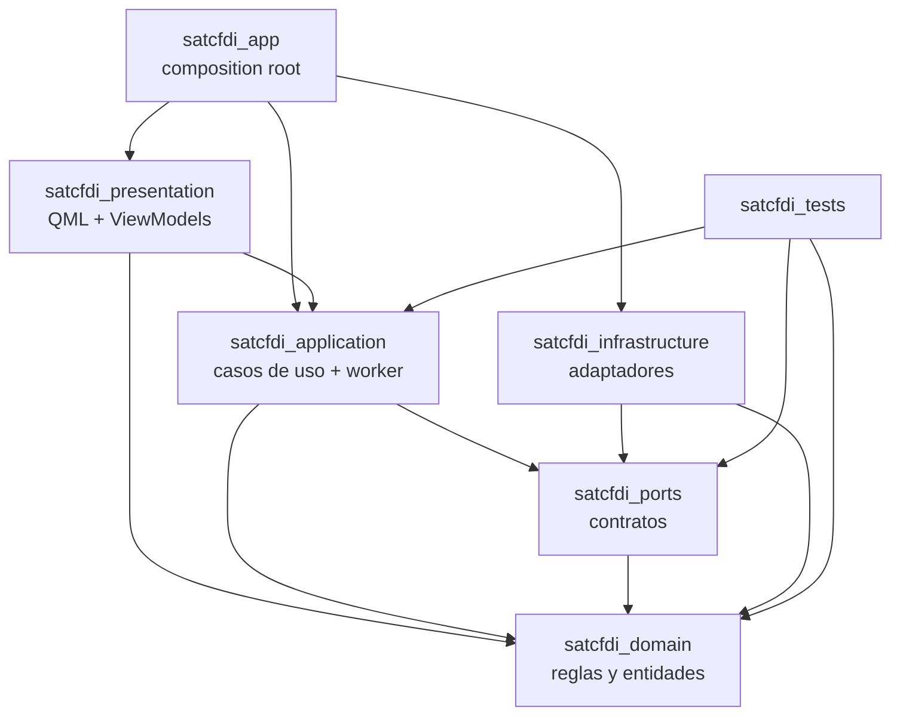

# Estructura Qt/CMake

Estado: borrador listo para implementar M1.

## Objetivo

Definir la estructura fisica inicial del proyecto Qt para implementar el MVP personal sin mezclar UI, reglas de negocio, persistencia, archivos, secretos e integracion SAT.

Este diseno asume `ADR 0011`: Qt 6, QML / Qt Quick Controls, C++ y CMake.

## Baseline tecnico

- Qt: 6.8 LTS como baseline recomendado para mantenimiento largo. No usar APIs que requieran una version mayor sin actualizar este documento.
- Build: CMake.
- Lenguaje: C++20.
- UI: QML con Qt Quick Controls.
- App event loop: `QApplication`, porque el MVP usa `QSystemTrayIcon` para menu bar/system tray.
- Base local: SQLite detras de repositorios.
- Tests: Qt Test para dominio y aplicacion.

## Targets CMake

| Target | Tipo | Responsabilidad | Dependencias permitidas |
| --- | --- | --- | --- |
| `satcfdi_domain` | static lib | Entidades, estados, filtros normalizados, reglas de transicion y retencion local. | `Qt6::Core` |
| `satcfdi_ports` | interface lib | Contratos C++: SAT, secretos, repositorios, paquetes, SO y sanitizacion. | `satcfdi_domain` |
| `satcfdi_application` | static lib | Casos de uso, ejecutor serial, worker, acciones manuales, coordinacion de repositorios y logs. | `satcfdi_domain`, `satcfdi_ports`, `Qt6::Core` |
| `satcfdi_infrastructure` | static lib | Adaptadores SQLite, SAT, archivos, macOS, Keychain y notificaciones. | `satcfdi_domain`, `satcfdi_ports`, `Qt6::Core`, `Qt6::Sql`, `Qt6::Network`, `Qt6::Widgets` |
| `satcfdi_presentation` | static lib / qml module | View models C++ y QML expuesto por la app. | `satcfdi_application`, `satcfdi_domain`, `Qt6::Core`, `Qt6::Qml`, `Qt6::Quick` |
| `satcfdi_app` | executable `MACOSX_BUNDLE` | `main.cpp`, composition root, recursos, bundle macOS. | Todos los targets anteriores, `Qt6::Widgets`, `Qt6::Quick` |
| `satcfdi_tests` | test executable | Tests unitarios de dominio y aplicacion con fakes. | `satcfdi_domain`, `satcfdi_application`, `satcfdi_ports`, `Qt6::Test` |

## Dependencias permitidas



Reglas:

- `domain` no conoce Qt Quick, QML, SQL, red, archivos, Keychain ni macOS.
- `application` no instancia adaptadores concretos. Solo usa contratos.
- `infrastructure` no decide flujos de negocio. Solo implementa contratos.
- `presentation` no ejecuta SQL, SOAP, filesystem ni Keychain directamente.
- `app` es el unico lugar donde se arma el grafo de objetos concretos.

## Arbol inicial de carpetas

```text
.
├── CMakeLists.txt
├── cmake/
│   └── warnings.cmake
├── resources/
│   ├── icons/
│   └── macos/
│       └── Info.plist.in
├── src/
│   ├── app/
│   │   ├── main.cpp
│   │   ├── AppBootstrapper.h
│   │   ├── AppBootstrapper.cpp
│   │   ├── AppCompositionRoot.h
│   │   └── AppCompositionRoot.cpp
│   ├── domain/
│   │   ├── common/
│   │   ├── perfiles/
│   │   ├── solicitudes/
│   │   ├── paquetes/
│   │   └── sat/
│   ├── ports/
│   │   ├── SatGateway.h
│   │   ├── SecretStore.h
│   │   ├── OSIntegration.h
│   │   ├── PackageStorage.h
│   │   ├── LogSanitizer.h
│   │   └── repositories/
│   ├── application/
│   │   ├── profiles/
│   │   ├── requests/
│   │   ├── actions/
│   │   ├── execution/
│   │   ├── worker/
│   │   └── logging/
│   ├── infrastructure/
│   │   ├── persistence/
│   │   │   ├── sqlite/
│   │   │   └── migrations/
│   │   │       └── 001_initial_schema.sql
│   │   ├── sat/
│   │   ├── storage/
│   │   ├── os/
│   │   │   └── macos/
│   │   └── secrets/
│   │       └── macos/
│   └── presentation/
│       ├── qml/
│       │   ├── Main.qml
│       │   ├── components/
│       │   └── screens/
│       │       ├── SolicitudesPage.qml
│       │       ├── NuevaSolicitudPage.qml
│       │       ├── DetalleSolicitudPage.qml
│       │       └── PerfilesSatPage.qml
│       └── viewmodels/
│           ├── AppViewModel.h
│           ├── SolicitudesListModel.h
│           ├── SolicitudDetailViewModel.h
│           ├── NuevaSolicitudViewModel.h
│           └── PerfilesSatViewModel.h
└── tests/
    ├── unit/
    └── fakes/
```

## QML y C++

QML debe tratarse como capa de presentacion. Sus responsabilidades son:

- Layout.
- Navegacion.
- Estados visuales.
- Validacion superficial de formulario.
- Invocar comandos de view models.

Los view models C++ deben exponer:

- Propiedades observables con `Q_PROPERTY`.
- Comandos invocables con `Q_INVOKABLE` o slots.
- Listas mediante `QAbstractListModel`.
- Senales para cambios de estado, errores visibles y navegacion.

QML no debe importar ni usar:

- Repositorios.
- Adaptadores SAT.
- `QSqlDatabase` o queries SQL.
- Keychain/SecretStore.
- `QFile` para paquetes ZIP.

## Asincronia y reglas de hilos

La UI QML corre en el hilo grafico. Ninguna llamada SAT, escritura SQLite, acceso a Keychain o escritura de ZIP debe bloquear ese hilo.

Reglas:

- `OperacionExecutor` vive en un hilo de trabajo o usa una cola serial fuera del hilo grafico.
- Worker y acciones manuales encolan operaciones en `OperacionExecutor`; no ejecutan directamente SAT, transacciones ni escrituras de ZIP.
- Cada hilo que use SQLite debe tener su propia conexion `QSqlDatabase`.
- Los repositorios no deben compartir una conexion abierta entre hilo grafico y ejecutor.
- Los modelos visuales basados en `QAbstractListModel` se actualizan en el hilo grafico.
- Los resultados del ejecutor regresan a view models mediante signals/slots con conexion encolada o un mecanismo equivalente seguro para Qt.
- La eliminacion local debe verificarse antes de aplicar cualquier resultado asincrono a una solicitud o paquete.

## Modulo QML

El ejecutable debe declarar un modulo QML propio con `qt_add_qml_module`.

URI sugerido:

```text
SatCfdiDownloader
```

La app debe usar `qt_standard_project_setup(REQUIRES 6.8)` para activar defaults modernos de CMake/Qt y mantener los recursos QML bajo rutas estables.

## Menu bar/system tray

El MVP debe implementar el icono de menu bar/system tray desde C++ usando `QSystemTrayIcon`.

Motivos:

- Es una API estable de Qt Widgets.
- Funciona en macOS y Windows.
- Permite mantener la ventana QML separada del control de ciclo de vida.
- Evita depender de `Qt.labs.platform.SystemTrayIcon` para una funcion central del MVP.

Consecuencia tecnica: `main.cpp` debe crear `QApplication`, no solo `QGuiApplication`.

## Fakes iniciales

Para avanzar M1 sin depender del SAT real desde el primer commit de codigo:

- `FakeSatGateway`: simula crear solicitud, verificar estados y devolver paquetes.
- `InMemorySecretStore`: solo para pruebas unitarias; la app real debe usar `MacOSSecretStore`.
- `FakeOSIntegration`: para tests de aplicacion.
- `TempPackageStorage`: para tests con carpetas temporales.

Los fakes no deben esconderse como implementacion productiva.

El uso de fakes permite construir el esqueleto de UI y estados, pero no completa el MVP SAT. Antes de depender de flujos funcionales productivos debe existir un spike de firma/autenticacion/operaciones SAT reales.

## CMake esperado

El `CMakeLists.txt` raiz debe:

- Declarar C++20.
- Buscar Qt 6 con componentes `Core`, `Qml`, `Quick`, `Sql`, `Network`, `Widgets` y `Test`.
- Definir targets internos por capa.
- Definir `satcfdi_app` como `MACOSX_BUNDLE`.
- Registrar QML con `qt_add_qml_module`.
- Activar tests con `enable_testing()` y `add_test()`.

Comandos esperados de desarrollo:

```bash
cmake -S . -B build
cmake --build build
ctest --test-dir build
```

## Primer corte implementable

El primer corte de codigo previo al spike SAT no debe tocar SAT real. Debe entregar lo minimo para validar estructura y ejecucion local:

- App Qt que abre una ventana QML.
- Targets CMake por capa compilando.
- Composition root inicial.
- Menu bar/system tray basico con abrir y salir.
- Un view model fake conectado a QML para validar el puente C++/QML.

Despues de ese corte se debe ejecutar el spike SAT de firma/autenticacion/operaciones antes de ampliar UI, repositorios o worker que dependan de contratos SOAP no comprobados. Luego se implementa SQLite real y se conecta el flujo con fakes o adaptadores productivos segun el resultado del spike.
