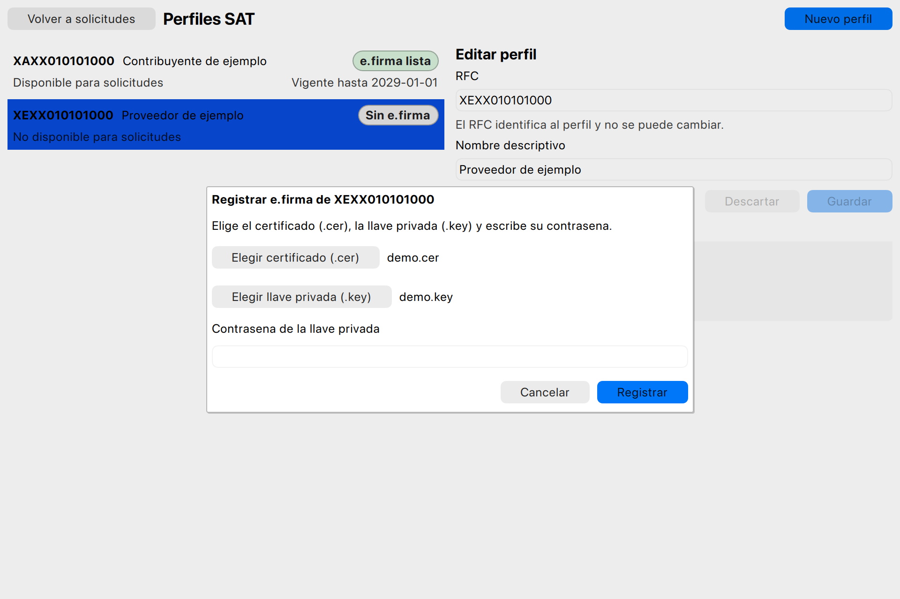
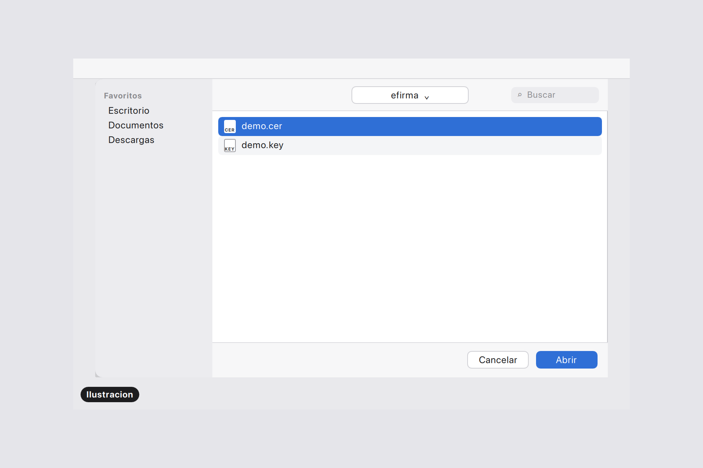
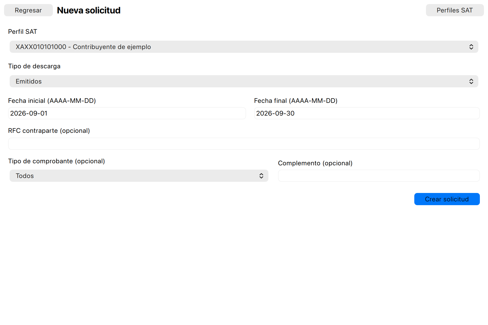
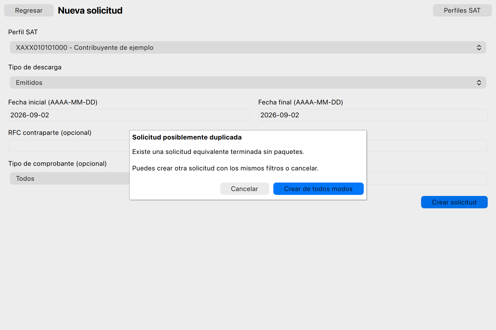
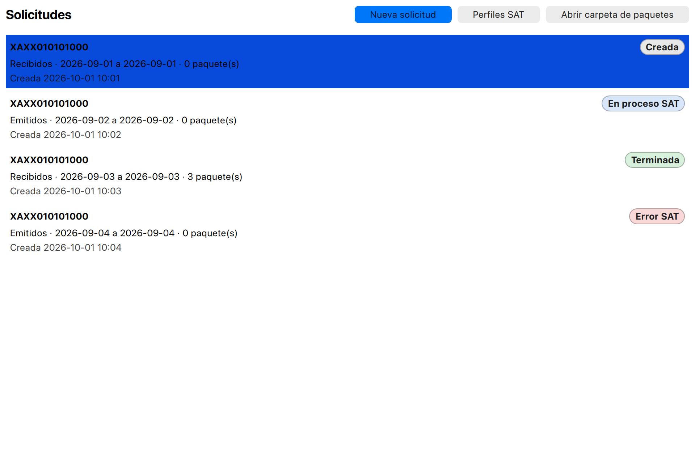
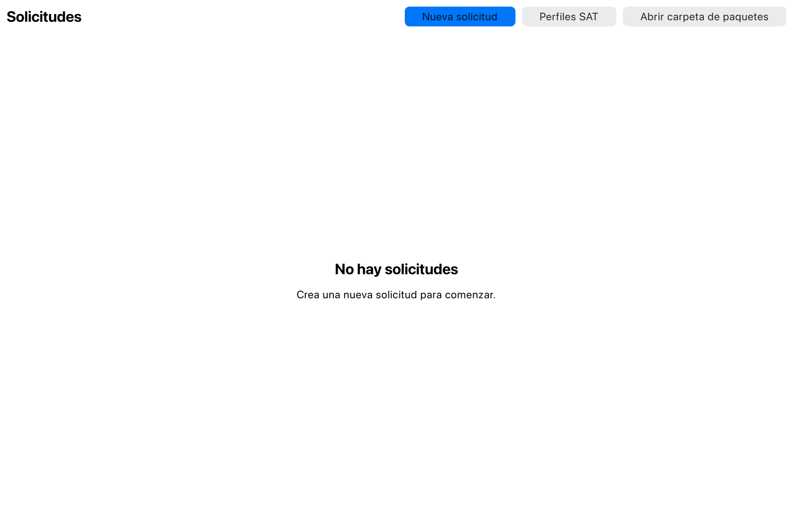
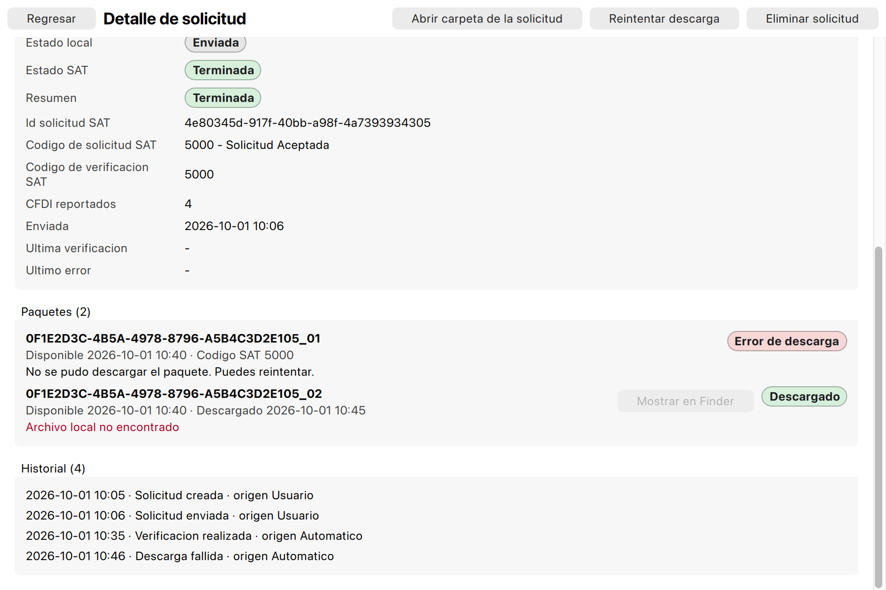
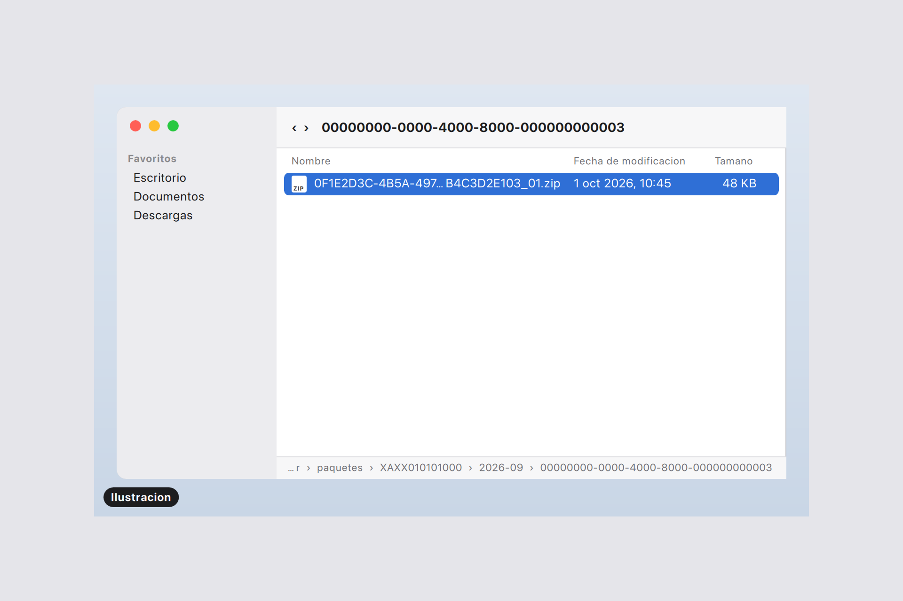
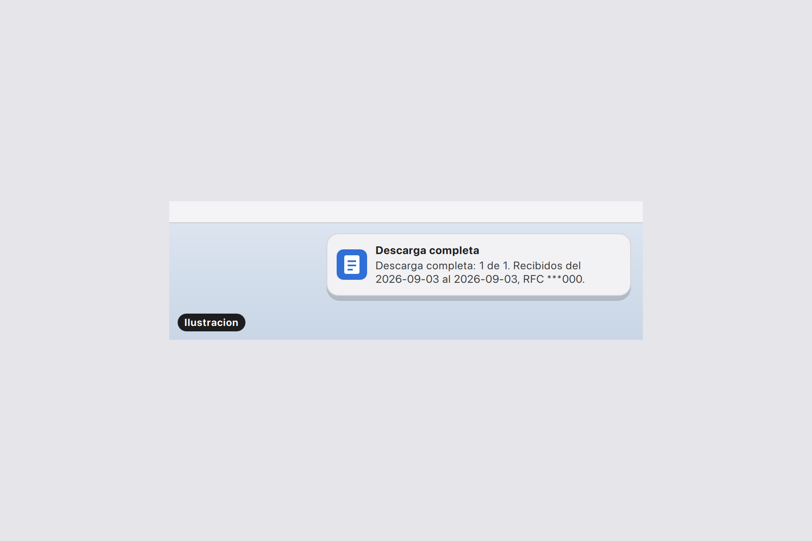

# SAT CFDI Downloader: manual de usuario

SAT CFDI Downloader es una aplicacion de escritorio para macOS. Sirve para
solicitar al SAT la descarga masiva de CFDI de los contribuyentes que
administras, darle seguimiento a cada solicitud y guardar en tu equipo los
paquetes ZIP que entrega el SAT. Todo se guarda localmente: perfiles,
solicitudes, historial y paquetes. La e.firma se guarda cifrada y su contrasena
queda en el llavero de macOS.

Las imagenes de este manual usan solo datos ficticios: RFC genericos del SAT
(`XAXX010101000`, `XEXX010101000`), identificadores inventados, archivos
`demo.cer` y `demo.key` y rutas bajo `/Users/usuario/...`. Las imagenes
marcadas como **Ilustracion** son dibujos simplificados de elementos de macOS
(menu bar, notificaciones, Finder y selector de archivos). Muestran los mismos
textos que la app, aunque su aspecto puede variar respecto de macOS.

Contenido:

1. [Perfiles SAT y e.firma](#1-perfiles-sat-y-efirma)
2. [Crear una nueva solicitud y resolver duplicados](#2-crear-una-nueva-solicitud-y-resolver-duplicados)
3. [Envio y monitoreo](#3-envio-y-monitoreo)
4. [Seguimiento en la lista de solicitudes](#4-seguimiento-en-la-lista-de-solicitudes)
5. [Detalle: filtros, estados, historial y paquetes](#5-detalle-filtros-estados-historial-y-paquetes)
6. [Paquetes en Finder](#6-paquetes-en-finder)
7. [Menu bar](#7-menu-bar)
8. [Notificaciones de macOS](#8-notificaciones-de-macos)
9. [Mensajes frecuentes y como resolverlos](#9-mensajes-frecuentes-y-como-resolverlos)

## 1. Perfiles SAT y e.firma

Un perfil SAT representa a un contribuyente: su RFC y un nombre descriptivo.
Para que un perfil pueda usarse en solicitudes debe estar activo y tener su
e.firma registrada y vigente. Abre la pantalla con el boton **Perfiles SAT**,
que esta en la lista de solicitudes y en Nueva solicitud. **Volver a
solicitudes** (o la tecla Escape) regresa a la lista.

### Crear o editar un perfil

1. Pulsa **Nuevo perfil**.
2. Escribe el **RFC** y un **Nombre descriptivo**, y pulsa **Guardar**.
   **Descartar** abandona los cambios.
3. Selecciona un perfil de la lista para editarlo. En edicion solo cambia el
   nombre: el RFC identifica al perfil y no se puede cambiar.

Si el RFC ya pertenece a otro perfil, la app muestra "Ya existe un perfil con
ese RFC." junto al campo RFC y conserva lo que escribiste. Otros avisos del
formulario: "El RFC no es valido." e "Indica un nombre para el perfil."

### Estado de la e.firma en la lista

Cada perfil muestra su RFC, su nombre, una etiqueta con el estado de la
e.firma y una linea de disponibilidad. La etiqueta usa color, pero el estado
siempre esta escrito.

| Etiqueta | Significado |
| --- | --- |
| Verificando | La app esta comprobando la e.firma guardada. |
| Sin e.firma | El perfil no tiene e.firma registrada. |
| e.firma lista | La e.firma esta registrada y vigente. |
| e.firma vencida | La e.firma ya no es vigente; hay que reemplazarla. |
| e.firma aun no vigente | La e.firma todavia no entra en vigor. |
| e.firma incompleta en el llavero / e.firma danada en el llavero | No se pudo leer la e.firma guardada; vuelve a registrarla. |
| Estado no disponible | No se pudo consultar el estado (por ejemplo, con el llavero bloqueado). Usa **Reintentar** en la fila, **Reintentar estado** en el formulario o la tecla R sobre la fila. |

La linea de disponibilidad dice "Disponible para solicitudes", "No disponible
para solicitudes" o, si el perfil esta inactivo, "Inactivo: no disponible para
solicitudes". Si la e.firma tiene vigencia conocida, tambien aparece "Vigente
hasta AAAA-MM-DD".

### Registrar la e.firma

1. Selecciona el perfil. Si tienes cambios sin guardar, primero guarda el
   perfil ("Guarda el perfil antes de gestionar su e.firma.").
2. En la seccion **e.firma**, pulsa **Registrar e.firma**.
3. Pulsa **Elegir certificado (.cer)** y **Elegir llave privada (.key)**. Cada
   boton abre el selector de archivos de macOS. Junto a cada boton solo se
   muestra el nombre del archivo, nunca su ruta.
4. Escribe la **Contrasena de la llave privada** y pulsa **Registrar** (o
   Enter en el campo de contrasena).
5. Mientras se valida aparece "Validando e.firma...". Al terminar aparece
   "e.firma registrada." y el boton **Cerrar**.

El campo de contrasena se vacia al enviar, al cancelar, al cerrar el dialogo,
al cambiar de perfil, al salir de la pantalla y al ocultar la ventana.

### Reemplazar la e.firma

Si el perfil ya tiene e.firma, el boton dice **Reemplazar e.firma**. Antes de
capturar los archivos, la app pide confirmacion: "La e.firma registrada de
`<RFC>` se reemplazara solo si la nueva se valida. Si falla, la actual sigue
registrada sin cambios." Pulsa **Continuar** y sigue los mismos pasos que en
el registro; el boton final dice **Reemplazar**. Si el reemplazo falla, el
mensaje termina con "La e.firma anterior sigue registrada sin cambios." y la
lista vuelve a mostrar el estado real de la e.firma anterior.

Los errores al registrar o reemplazar estan en la [seccion 9](#9-mensajes-frecuentes-y-como-resolverlos).

## 2. Crear una nueva solicitud y resolver duplicados

Pulsa **Nueva solicitud** en la lista o en el menu bar.

1. **Perfil SAT**: elige el contribuyente. Solo aparecen los perfiles activos
   con la e.firma lista. Si no hay ninguno, la pantalla dice "No hay perfiles
   SAT listos para solicitudes. Un perfil necesita estar activo y tener su
   e.firma registrada y vigente." y ofrece **Administrar perfiles SAT**.
2. **Tipo de descarga**: Emitidos o Recibidos. Al abrir el formulario vale
   Emitidos.
3. **Fecha inicial** y **Fecha final** en formato AAAA-MM-DD. Al abrir el
   formulario se propone del primer dia del mes actual a hoy.
4. Opcionales: **RFC contraparte**; **Tipo de comprobante** (Todos, I -
   Ingreso, E - Egreso, T - Traslado, N - Nomina, P - Pago) y
   **Complemento**.
5. Pulsa **Crear solicitud** (o Enter en un campo de texto). **Regresar** o
   Escape vuelve a la lista sin crear nada.

Avisos del formulario: "Selecciona un perfil SAT.", "Indica una fecha inicial
valida (AAAA-MM-DD).", "Indica una fecha final valida (AAAA-MM-DD).", "La fecha
final debe ser igual o posterior a la fecha inicial." y "El perfil SAT
seleccionado ya no esta disponible."

Al crearla, la solicitud se guarda en el equipo, se abre su detalle y la app
se encarga del envio al SAT (ver la [seccion 3](#3-envio-y-monitoreo)).

### Solicitudes equivalentes

Antes de crear, la app compara los filtros con las solicitudes que ya tienes.

- **Bloqueado**: si ya hay una solicitud equivalente que impide crear otra,
  aparece "No se puede crear: ya existe una solicitud equivalente." seguido del
  motivo, y el boton **Ver solicitud existente** abre su detalle. Motivos:
  "Hay una solicitud equivalente en curso.", "Hay una solicitud equivalente
  terminada con paquetes pendientes de descargar." y "Ya existe una solicitud
  equivalente terminada y descargada."
- **Requiere confirmacion**: el dialogo "Solicitud posiblemente duplicada"
  muestra el motivo. **Crear de todos modos** crea la solicitud con los mismos
  filtros y **Cancelar** (o Escape) no crea nada. Motivos: "Existe una
  solicitud equivalente terminada cuyos paquetes vencieron.", "Existe una
  solicitud equivalente terminada sin paquetes.", "Existe una solicitud
  equivalente con envio incierto: el SAT pudo haberla recibido.", "Existe una
  solicitud equivalente que no tuvo exito." y "Existe una solicitud equivalente
  que eliminaste localmente."

## 3. Envio y monitoreo

Mientras la app esta abierta, aunque la ventana este oculta, un proceso local
hace el trabajo con el SAT en este orden:

1. **Envio**: al crear una solicitud, la app la envia al SAT con la e.firma del
   perfil. Mientras tanto la solicitud aparece como "Enviando".
2. **Verificacion**: una vez enviada, consulta periodicamente su estado en el
   SAT (Aceptada por SAT, En proceso SAT, Terminada...).
3. **Descarga**: cuando el SAT termina y hay paquetes, los descarga y los
   guarda en la carpeta de paquetes (ver la [seccion 6](#6-paquetes-en-finder)).

Pasos manuales en el detalle de la solicitud:

- **Enviar**: aparece en solicitudes "Creada", por ejemplo si el envio no pudo
  iniciarse. Solo se habilita si la e.firma del perfil esta lista; si no, se
  muestra el motivo (por ejemplo "Este perfil no tiene e.firma registrada.
  Registrala para continuar."). Al pulsarlo se lee "Envio solicitado."
- **Verificar ahora**: aparece en solicitudes enviadas que aun no tienen un
  estado final en el SAT. Muestra "Verificacion solicitada. Si el monitoreo esta
  pausado, queda pendiente."
- **Reintentar descarga**: aparece si algun paquete esta "Disponible" o con
  "Error de descarga". Muestra "Descarga solicitada. Si el monitoreo esta
  pausado, queda pendiente."

El monitoreo se pausa y se reanuda desde el menu bar ([seccion 7](#7-menu-bar)).
Con el monitoreo en pausa no se trabaja con el SAT: las acciones pedidas se
guardan y el menu bar muestra cuantas hay pendientes ("Pendientes: N").

Una solicitud que termino en "Envio fallido" o "Envio incierto" no se reenvia.
Si necesitas repetirla, crea una nueva; la app te pedira confirmar el
duplicado.

## 4. Seguimiento en la lista de solicitudes

La pantalla **Solicitudes** muestra las solicitudes de la mas reciente a la mas
antigua. Cada fila indica el RFC del perfil, el tipo de descarga, el rango de
fechas, el numero de paquetes, la fecha de creacion y una etiqueta de estado.

Acciones de la lista:

- Haz clic en una fila, o usa las flechas y Enter o Espacio, para abrir el
  detalle.
- **Nueva solicitud**, **Perfiles SAT** y **Abrir carpeta de paquetes** (abre
  en Finder la carpeta donde se guardan los paquetes).

Estados que puede mostrar la etiqueta:

| Estado | Significado |
| --- | --- |
| Creada | Guardada en el equipo; aun no se envia al SAT. |
| Enviando | Se esta enviando al SAT. |
| Enviada | El SAT recibio la solicitud; aun no hay estado del SAT. |
| Envio fallido | El SAT rechazo la solicitud; no se registro en el SAT. |
| Envio incierto | No se sabe si el SAT registro la solicitud; no se reenvia automaticamente. |
| Aceptada por SAT | El SAT acepto la solicitud y la esta atendiendo. |
| En proceso SAT | El SAT esta preparando los paquetes. |
| Terminada | El SAT termino; los paquetes estan listos o ya se descargaron. |
| Error SAT | El SAT reporto un error en la solicitud. |
| Rechazada por SAT | El SAT rechazo la solicitud. |
| Vencida | La solicitud vencio en el SAT. |

Si no hay solicitudes, la lista dice "No hay solicitudes" y "Crea una nueva
solicitud para comenzar."

Si la lista no se puede leer, aparece "No se pudo cargar la lista de
solicitudes." y el boton **Reintentar**. Si las notificaciones de macOS estan
desactivadas, la lista muestra "Las notificaciones estan deshabilitadas.
Activalas en Ajustes del Sistema para recibir avisos."

## 5. Detalle: filtros, estados, historial y paquetes

El detalle tiene estas secciones:

- **Solicitud**: identificador local, perfil, tipo de descarga y fecha de creacion.
- **Filtros**: fechas, RFC contraparte, tipo de comprobante y complemento.
- **Estado**:
  - **Estado local**: lo que hizo la app.
  - **Estado SAT**: la respuesta del SAT; si aun no hay, dice "Sin respuesta del SAT".
  - **Resumen**: el estado que tambien aparece en la lista.
  - Datos del SAT: Id solicitud SAT, Codigo de solicitud SAT, Codigo de
    verificacion SAT, CFDI reportados, Enviada, Ultima verificacion y Ultimo
    error.
- **Paquetes**: uno por paquete del SAT, con su estado de descarga.
- **Historial**: los eventos de la solicitud con fecha, descripcion y origen
  (Usuario o Automatico).

Botones de la parte superior: **Regresar**, **Enviar**, **Verificar ahora** y
**Reintentar descarga** (cuando aplican; ver la [seccion 3](#3-envio-y-monitoreo)),
**Abrir carpeta de la solicitud** y **Eliminar solicitud**.

Estados de un paquete:

| Estado | Significado |
| --- | --- |
| Disponible | El SAT lo tiene listo; la app lo descargara. |
| Descargando | Se esta descargando. |
| Descargado | Ya esta guardado en el equipo. |
| Error de descarga | No se pudo descargar ("No se pudo descargar el paquete. Puedes reintentar." o "El paquete alcanzo el maximo de descargas permitidas."; en este ultimo caso no aparece **Reintentar descarga**). |
| Vencido | "El paquete ya no existe en el SAT (vencido)." |

En los paquetes descargados, la app comprueba el archivo local y muestra
"Archivo local presente", "Archivo local no encontrado" o "No se pudo comprobar
el archivo local". **Mostrar en Finder** solo se habilita si el archivo esta
presente.

**Eliminar solicitud** pide confirmacion: "La solicitud se eliminara de esta
aplicacion. No se modifica nada en el SAT." Despues de eliminarla vuelves a la
lista. Si abres una solicitud que ya no existe, el detalle dice "Solicitud no
encontrada".

## 6. Paquetes en Finder

Los paquetes se guardan como ZIP en la carpeta `SAT-CFDI-Downloader/paquetes`
de tu carpeta de usuario, organizados por RFC, mes de la solicitud e
identificador local. La app no abre ni modifica los ZIP.

Hay tres formas de llegar a ellos:

- **Mostrar en Finder**, en un paquete Descargado del detalle, abre Finder con
  el ZIP seleccionado.
- **Abrir carpeta de la solicitud**, en el detalle, abre la carpeta con los
  paquetes de esa solicitud.
- **Abrir carpeta de paquetes**, en la lista o en el menu bar, abre la carpeta
  principal de paquetes.

Si el destino no existe o Finder no responde, la app lo avisa con "Archivo
local no encontrado", "Carpeta de paquetes no encontrada" o "No se pudo abrir
Finder". Estas acciones no cambian ningun estado.

## 7. Menu bar

La app pone un icono en la barra de menus de macOS. Cerrar la ventana solo la
oculta: la app y el monitoreo siguen activos.

| Opcion | Para que sirve |
| --- | --- |
| Mostrar ventana | Muestra y trae al frente la ventana principal. |
| Nueva solicitud | Muestra la ventana en el formulario de nueva solicitud. |
| Abrir carpeta de paquetes | Abre en Finder la carpeta de paquetes. |
| Monitoreo activo / Monitoreo pausado / Trabajando: enviando... / verificando... / descargando... | Linea informativa con lo que hace el monitoreo. |
| Pendientes: N | Acciones guardadas durante una pausa; solo aparece si hay alguna. |
| Pausar monitoreo / Reanudar monitoreo | Detiene o reanuda el trabajo con el SAT. La pausa se recuerda al volver a abrir la app. |
| Iniciar al iniciar sesion | Abre la app al iniciar sesion en macOS, sin mostrar la ventana. |
| Estado en macOS: ... | Lo que macOS reporta para ese inicio automatico: habilitado, deshabilitado, pendiente de aprobacion, rechazado o no disponible. Si esta pendiente o rechazado aparece **Abrir ajustes de inicio de sesion...** |
| Notificaciones: ... | Permiso de notificaciones: sin permiso solicitado, permitidas, deshabilitadas o no disponibles. Segun el caso aparecen **Solicitar permiso de notificaciones**, **Enviar notificacion de prueba** o **Abrir ajustes de notificaciones...** |
| Salir | Termina la app de forma ordenada: espera la operacion en curso y cierra. |

## 8. Notificaciones de macOS

Con el permiso concedido, la app avisa con notificaciones de macOS de estos
cambios:

- **Solicitud terminada**: el SAT termino la solicitud, con el numero de paquetes.
- **Descarga completa**: se descargaron los paquetes, por ejemplo "Descarga
  completa: 1 de 1."
- **Error en el SAT**: "El SAT reporto un error en la solicitud."
- **Solicitud rechazada**: "El SAT rechazo la solicitud."
- **Solicitud vencida**: "La solicitud vencio en el SAT; los paquetes pueden ya
  no estar disponibles."
- **e.firma de un perfil**: la e.firma de un perfil dejo de estar lista. El
  texto explica la causa y termina con "El monitoreo de ese perfil esta en
  pausa."

Las notificaciones de solicitudes agregan el tipo de descarga, el rango de
fechas y el RFC abreviado a sus ultimos tres caracteres (por ejemplo `***000`).

Para comprobar las notificaciones usa **Enviar notificacion de prueba** en el
menu bar. Si las desactivas en Ajustes del Sistema, la app sigue funcionando
igual; solo deja de avisar y la lista muestra un aviso.

## 9. Mensajes frecuentes y como resolverlos

### e.firma (al registrar o reemplazar)

| Mensaje | Que hacer |
| --- | --- |
| No se pudo leer el certificado o la llave. / El certificado o la llave no tienen un formato valido. | Elige otra vez el `.cer` o la `.key`; el foco va al archivo con problema. |
| La contrasena de la llave privada es incorrecta. | Escribe de nuevo la contrasena. |
| El certificado y la llave privada no corresponden. | Usa el `.cer` y la `.key` de la misma e.firma. |
| El RFC del certificado no coincide con el del perfil. | Usa la e.firma del contribuyente de ese perfil. |
| El certificado no es una e.firma admisible. | Usa el certificado de e.firma del contribuyente. |
| La e.firma esta vencida. / La e.firma aun no es vigente. | Usa una e.firma vigente. |
| El llavero esta bloqueado; intenta de nuevo tras desbloquear la sesion. / Se denego el acceso al llavero. / La operacion se cancelo. | Desbloquea tu sesion o permite el acceso en el aviso de macOS e intenta de nuevo. |
| El perfil esta inactivo; no se puede registrar su e.firma. | Solo los perfiles activos pueden registrar e.firma. |

### Envio y verificacion

| Mensaje | Que hacer |
| --- | --- |
| Este perfil no tiene e.firma registrada. Registrala para continuar. | Registra la e.firma en Perfiles SAT y pulsa **Enviar**. |
| La e.firma de este perfil esta vencida. Reemplazala para continuar. | Reemplaza la e.firma y pulsa **Enviar**. |
| No se pudo leer la e.firma guardada. Vuelve a importarla. | Vuelve a registrar la e.firma del perfil. |
| El llavero de macOS esta bloqueado. Desbloquea tu sesion e intenta de nuevo. | Desbloquea la sesion e intenta de nuevo. |
| El SAT no acepto la autenticacion con esta e.firma. | Revisa que la e.firma sea la correcta y este vigente. |
| No se pudo conectar con el SAT para autenticar. Intenta mas tarde. / No se pudo conectar con el SAT; la solicitud no se envio. | Revisa tu conexion; la solicitud queda en Creada y puedes pulsar **Enviar** despues. |
| El SAT rechazo la solicitud (codigo N). No se registro en el SAT. | Revisa los filtros y crea una solicitud nueva si hace falta. |
| No estas autorizado para descargar estos CFDI (5001). | La e.firma no tiene permiso sobre esos CFDI. |
| El SAT ya no acepta solicitudes con este mismo criterio. (5002) | Cambia los filtros. |
| La consulta supera el maximo de CFDI; usa un rango mas corto. (5003) | Divide el rango de fechas. |
| El SAT ya tiene una solicitud activa con este criterio. (5005) | Espera a la solicitud existente. |
| Se alcanzo el limite diario del SAT. Intenta manana. (5011) | Intenta al dia siguiente. |
| No se sabe si el SAT registro la solicitud. No se reenviara automaticamente; revisa antes de crear otra. | Revisa con el SAT antes de crear otra; la app pedira confirmar el duplicado. |
| No se pudo consultar el estado; se reintentara automaticamente. | No hace falta hacer nada; tambien puedes usar **Verificar ahora**. |
| El SAT no encontro esta solicitud. La verificacion automatica se detuvo. | Crea una solicitud nueva si todavia la necesitas. |

### Paquetes y archivos

| Mensaje | Que hacer |
| --- | --- |
| No se pudo descargar el paquete. Puedes reintentar. | Pulsa **Reintentar descarga**. |
| El paquete alcanzo el maximo de descargas permitidas. | El SAT ya no permite descargarlo de nuevo. |
| El paquete ya no existe en el SAT (vencido). | Crea una solicitud nueva para el mismo periodo. |
| No hay espacio suficiente para guardar el paquete. | Libera espacio en disco y reintenta la descarga. |
| No se pudo escribir en la carpeta de paquetes; revisa los permisos. | Revisa los permisos de la carpeta de paquetes. |
| Ya existe un archivo con ese nombre en la carpeta del paquete. | Mueve o renombra el archivo existente y reintenta. |
| Archivo local no encontrado | El ZIP se movio o se borro fuera de la app. El estado del paquete no cambia. |
| Carpeta de paquetes no encontrada / No se pudo abrir Finder | Revisa que la carpeta exista e intenta de nuevo. |

### Otros

- "No se pudo cargar la lista de solicitudes." o "No se pudo cargar la
  solicitud.": pulsa **Reintentar**.
- "No se pudo eliminar la solicitud. Intenta de nuevo.": intenta eliminarla otra vez.
- "No se pudieron cargar los perfiles SAT.": usa **Reintentar** en Perfiles SAT.
